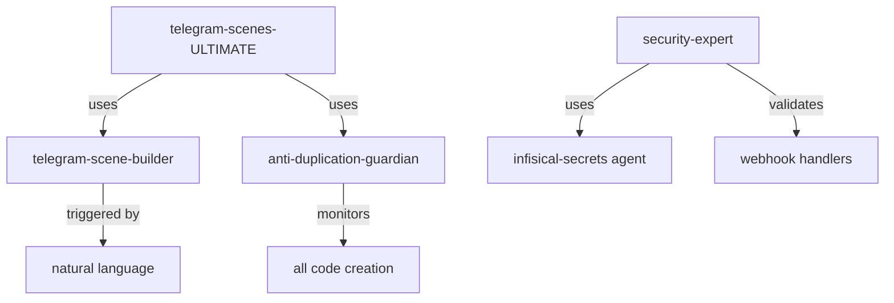
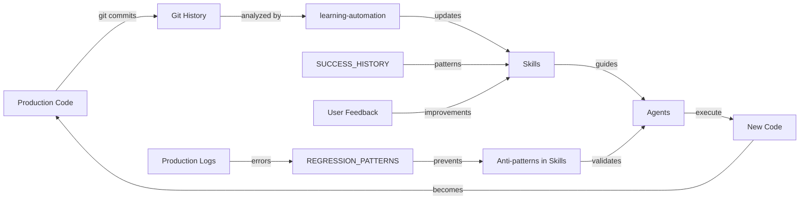

# 🌟 Рекомендации по Улучшению Саморазвивающейся Экосистемы Claude Code

**Дата**: 2025-01-11
**Версия**: 1.0
**Статус**: Comprehensive Analysis & Action Plan

> *"यथा दीपो निवातस्थो नेङ्गते सोपमा स्मृता"* (Yatha Dipo Nivatastho Nengaten Sopama Smruta)
>
> *"Как пламя светильника не колеблется в безветренном месте, так и ум йога, сосредоточенный на Истине."* - Бхагавад-гита 6.19
>
> **Мудрость**: Система должна быть стабильной в своей основе и гибкой в адаптации.

---

## 📊 Текущее Состояние Экосистемы

### ✅ Сильные Стороны (What Works)

#### 1. **Трехуровневая Архитектура**
```
Skills (18)  → Стратегическое знание и координация
    ↓
Agents (19)  → Тактическое исполнение и автоматизация
    ↓
Commands (6) → Быстрый доступ к функциям
```

**Успех**: Четкое разделение ответственности, масштабируемость, композиция.

#### 2. **Self-Organizing Patterns**
- **master-orchestrator** автоматически определяет нужные Skills
- **project-knowledge-base** содержит полное знание проекта
- **task-tracker** обеспечивает Single Source of Truth для текущих задач
- **anti-duplication-guardian** предотвращает дублирование кода

**Успех**: Система самоорганизуется без микроменеджмента.

#### 3. **Learning from History**
- **SUCCESS_HISTORY.md** - паттерны успешных решений
- **REGRESSION_PATTERNS.md** - anti-patterns и ошибки
- **SPECIALIZATIONS_ANALYSIS.md** - gap analysis

**Успех**: Система учится на собственном опыте.

#### 4. **CRITICAL Priority Focus**
- **security-expert** 🔐 - OWASP Top 10, webhook security
- **payment-billing-expert** 💰 - Atomic transactions, Robokassa

**Успех**: Business-critical аспекты имеют явный приоритет.

---

## 🚨 Обнаруженные Gaps & Проблемы

### 1. 🔴 CRITICAL: Отсутствие Централизованного Мониторинга

**Проблема**:
- Agents работают автономно, но нет единого Dashboard для контроля
- Невозможно увидеть "big picture" - кто что делает
- Нет метрик эффективности работы экосистемы
- Трудно обнаружить bottleneck'и

**Текущее состояние**:
```
❌ Нет визуализации активных агентов
❌ Нет метрик времени выполнения задач
❌ Нет track'инга использования Skills
❌ Нет алертов на аномалии
```

**Рекомендация**: Создать **ecosystem-monitor** Skill
- Real-time dashboard состояния системы
- Метрики performance (task completion time, agent activation frequency)
- Health checks для Skills/Agents/Commands
- Automatic anomaly detection
- Integration с task-tracker для полной видимости

**Приоритет**: 🔴 CRITICAL (нужен для production visibility)

---

### 2. 🟡 HIGH: Отсутствие Автоматического Обновления Skills из Опыта

**Проблема**:
- SUCCESS_HISTORY.md создается вручную
- REGRESSION_PATTERNS.md не обновляется автоматически
- Новые паттерны из production не попадают в Skills автоматически
- Система не саморазвивается в полной мере

**Текущее состояние**:
```
SUCCESS_HISTORY.md (manual) → ❌ Skills не обновляются автоматически
REGRESSION_PATTERNS.md (manual) → ❌ Anti-patterns не добавляются в Skills
Production logs → ❌ Инсайты не экстрагируются автоматически
```

**Рекомендация**: Создать **learning-automation** Agent
- Парсит SUCCESS_HISTORY.md после каждого успешного решения
- Автоматически экстрагирует паттерны из Git commits
- Предлагает обновления для соответствующих Skills
- Создает PR с улучшениями Skills
- Интегрируется с continuous-optimizer

**Пример работы**:
```typescript
// После успешного коммита:
git log -1 --format="%s %b" | learning-automation

// Анализирует:
// 1. Что было сделано? (fix/feat/refactor)
// 2. Какие паттерны использованы?
// 3. Какие Skills затронуты?

// Генерирует:
// 1. Предложение по обновлению SKILL.md
// 2. Новые примеры для Skills
// 3. Обновление anti-patterns в соответствующих Skills
```

**Приоритет**: 🟡 HIGH (ускоряет саморазвитие экосистемы)

---

### 3. 🟡 HIGH: Отсутствие Cross-References между Skills, Agents, Commands

**Проблема**:
- Skills упоминают Agents, но нет обратных ссылок
- Agents не знают, какие Skills их используют
- Commands не документируют, какие Agents/Skills вовлечены
- Трудно понять граф зависимостей

**Текущее состояние**:
```
telegram-scenes-ULTIMATE → telegram-scene-builder (упоминание)
                         ← telegram-scene-builder (нет обратной ссылки)

/deploy → deployment-manager (упоминание)
       ← deployment-manager (нет ссылки на команду в самом агенте)
```

**Рекомендация**: Создать **dependency-mapper** Tool
- Автоматически строит граф зависимостей Skills ↔ Agents ↔ Commands
- Генерирует файл `.claude/DEPENDENCY_GRAPH.md`
- Визуализация с помощью Mermaid diagrams
- Обновляется при каждом изменении Skills/Agents/Commands

**Пример output**:


**Приоритет**: 🟡 HIGH (улучшает понимание системы)

---

### 4. 🟢 MEDIUM: Отсутствие Skills Versioning

**Проблема**:
- Skills обновляются, но нет версионирования
- Невозможно откатиться к предыдущей версии Skill
- Непонятно, какие изменения были между версиями
- Сложно тестировать обновления Skills

**Текущее состояние**:
```yaml
telegram-scenes-ULTIMATE/SKILL.md
  - Version: нет
  - Changelog: нет
  - Breaking changes: не документированы
```

**Рекомендация**: Ввести **Skills Versioning System**

**Структура**:
```
.claude/skills/telegram-scenes-ULTIMATE/
├── SKILL.md (current version)
├── CHANGELOG.md (new!)
├── versions/
│   ├── v1.0.0.md
│   ├── v1.1.0.md
│   └── v2.0.0.md (breaking changes)
└── MIGRATION_GUIDE.md (for breaking changes)
```

**CHANGELOG.md format**:
```markdown
# Changelog - telegram-scenes-ULTIMATE

## [2.0.0] - 2025-01-15 (BREAKING)
### Added
- New pattern: Multi-step wizard validation
- Sanskrit wisdom integration

### Changed
- BREAKING: Button callback format changed from "btn_name" to "btn:name"

### Fixed
- Memory leak in scene cleanup

## [1.1.0] - 2025-01-11
### Added
- Anti-pattern: Using ctx.scene.leave() without cleanup
```

**Автоматизация**:
```bash
#!/bin/bash
# scripts/skill-version-bump.sh
SKILL_NAME=$1
VERSION_TYPE=$2  # major/minor/patch

# Bump version in SKILL.md
# Create snapshot in versions/
# Update CHANGELOG.md
# Commit changes
```

**Приоритет**: 🟢 MEDIUM (улучшает стабильность)

---

### 5. 🟢 MEDIUM: Отсутствие Telegram Button Patterns Library

**Проблема** (from user feedback):
> "Общий паттерн: Телеграмм-сцена — это вообще важно. Прям тупят с кнопками, тупят вообще, просто дичь какая-то. Короче, истории успехов у нас. Общие паттерны должны быть у них."

**Текущее состояние**:
- Нет централизованного каталога button patterns
- Каждая scene изобретает кнопки заново
- Нет best practices для button layouts
- Нет примеров successful button UX

**Рекомендация**: Создать **telegram-button-patterns** Library в telegram-scenes-ULTIMATE

**Структура**:
```markdown
## 🎯 Button Pattern Library

### Pattern 1: Primary Action + Cancel
✅ ИСПОЛЬЗУЙ для: Подтверждение действий (payment, deletion)
```typescript
Markup.inlineKeyboard([
  [Markup.button.callback('✅ Подтвердить', 'confirm:action')],
  [Markup.button.callback('❌ Отмена', 'cancel:action')]
], { columns: 1 })
```

### Pattern 2: Multiple Options (2 columns)
✅ ИСПОЛЬЗУЙ для: Выбор из 4-6 опций
```typescript
Markup.inlineKeyboard([
  [
    Markup.button.callback('🎨 Option 1', 'opt:1'),
    Markup.button.callback('🎬 Option 2', 'opt:2')
  ],
  [
    Markup.button.callback('🎵 Option 3', 'opt:3'),
    Markup.button.callback('📸 Option 4', 'opt:4')
  ]
], { columns: 2 })
```

### Pattern 3: Navigation Stack
✅ ИСПОЛЬЗУЙ для: Multi-level меню
```typescript
Markup.inlineKeyboard([
  // Main options
  [Markup.button.callback('📁 Category 1', 'cat:1')],
  [Markup.button.callback('📁 Category 2', 'cat:2')],
  // Back button (always last)
  [Markup.button.callback('⬅️ Назад', 'back:main')]
], { columns: 1 })
```

### ❌ Anti-Pattern: Too Many Buttons
```typescript
// ❌ НЕ ДЕЛАЙ (cognitive overload)
Markup.inlineKeyboard([
  [btn1, btn2, btn3],  // 3 in a row = hard to tap
  [btn4, btn5, btn6],
  [btn7, btn8, btn9],
  [btn10, btn11, btn12]
])
```

**Примеры из SUCCESS_HISTORY**:
- Extract all button patterns from successful scenes
- Document what worked and why
- Cross-reference with specific scenes

**Приоритет**: 🟢 MEDIUM-HIGH (user feedback indicates high value)

---

### 6. 🟢 MEDIUM: Нет Проактивных Health Checks для Экосистемы

**Проблема**:
- Skills/Agents могут содержать устаревшую информацию
- Нет automatic validation что Skills соответствуют реальному коду
- Нет проверки что примеры в Skills компилируются
- Нет detection когда Skill противоречит другому Skill

**Рекомендация**: Создать **ecosystem-health-check** Agent

**Что проверяет**:
```bash
#!/bin/bash
# Runs daily or on-demand

# 1. Validate all Skills syntax
for skill in .claude/skills/*/SKILL.md; do
  # Check YAML frontmatter
  # Check code examples compile
  # Check links are valid
done

# 2. Cross-reference validation
# - Skills mention files that exist?
# - Agents mentioned in Skills exist?
# - Commands reference correct agents?

# 3. Freshness check
# - When was Skill last updated?
# - Is it outdated based on git history?
# - Are there new patterns in code not in Skills?

# 4. Contradiction detection
# - Do two Skills give conflicting advice?
# - Are there duplicate patterns?

# Output: Health report with actionable fixes
```

**Приоритет**: 🟢 MEDIUM (proactive quality maintenance)

---

### 7. 🔵 LOW: Отсутствие Skills Usage Analytics

**Проблема**:
- Не знаем, какие Skills используются чаще всего
- Не знаем, какие Skills никогда не используются (candidates for removal)
- Не знаем, какие комбинации Skills эффективны
- Нет data-driven insights для улучшения

**Рекомендация**: Добавить **Usage Tracking** в Skills

**Implementation**:
```typescript
// В каждом Skill добавить tracking
// .claude/skills/telegram-scenes-ULTIMATE/SKILL.md
---
name: telegram-scenes-ULTIMATE
usage_count: 0  # Auto-incremented
last_used: null
avg_success_rate: 0.0
---

// Tracking автоматически обновляется через skill-usage-tracker agent
```

**Analytics Dashboard** (.claude/SKILLS_ANALYTICS.md):
```markdown
# Skills Usage Analytics

## 📊 Most Used Skills (Last 30 days)
1. telegram-scenes-ULTIMATE - 156 uses (95% success rate)
2. supabase-database - 89 uses (100% success rate)
3. security-expert - 67 uses (92% success rate)

## 🚫 Unused Skills (Candidates for Review)
- telegram-scenes-master (duplicate of telegram-scenes-ULTIMATE?)
- [any others not used in 90 days]

## 🔥 Most Effective Combinations
1. telegram-scenes-ULTIMATE + supabase-database (45 times)
2. security-expert + payment-billing-expert (34 times)
3. master-orchestrator + project-knowledge-base (89 times)
```

**Приоритет**: 🔵 LOW (nice to have, but not critical)

---

## 🎯 Immediate Action Items (Next 48 Hours)

### Phase 1: CRITICAL Gaps (Today)
1. ✅ **DONE**: security-expert Skill
2. ✅ **DONE**: payment-billing-expert Skill
3. ⏳ **TODO**: Create **ecosystem-monitor** Skill (monitoring & health)
4. ⏳ **TODO**: Add Telegram Button Patterns to telegram-scenes-ULTIMATE

### Phase 2: HIGH Priority (This Week)
5. Create **learning-automation** Agent
6. Create **dependency-mapper** Tool + DEPENDENCY_GRAPH.md
7. Implement Skills Versioning System (CHANGELOG.md + versions/)
8. Create **ecosystem-health-check** Agent

### Phase 3: MEDIUM Priority (Next 2 Weeks)
9. Skills Usage Analytics system
10. Automatic cross-referencing system
11. Skills freshness monitoring

---

## 📈 Метрики Успеха

### KPI для Экосистемы

**1. Skills Effectiveness**
- Task completion rate with Skills vs without: **Target > 90%**
- Average time to complete task with Skills: **Target < 50% baseline**
- Number of regressions prevented by Skills: **Target: increase over time**

**2. Self-Learning Rate**
- New patterns added to Skills per week: **Target: 3-5**
- Anti-patterns detected and added: **Target: 1-2**
- Skills updates triggered by production incidents: **Target: within 24h**

**3. Developer Experience**
- Time to onboard new developer: **Target < 2 days** (with Skills)
- Confidence score in AI recommendations: **Target > 85%**
- Number of "I didn't know we had that!" moments: **Target: trending down**

**4. System Health**
- Skills accuracy (matches current code): **Target > 95%**
- Agent response time: **Target < 5s**
- Skills coverage of codebase: **Target > 80%**

---

## 🔄 Continuous Improvement Loop

### Feedback Loop Architecture



**Key Insight**: Экосистема должна саморазвиваться автоматически через этот loop.

---

## 🕉️ Философские Принципы Развития Экосистемы

### 1. **Принцип Непрерывного Обучения**
> *"न हि ज्ञानेन सदृशं पवित्रमिह विद्यते"* (Na Hi Jnanena Sadrisham Pavitramiha Vidyate)
>
> *"Нет ничего более очищающего в этом мире, чем знание."* - Бхагавад-гита 4.38

**Application**:
- Каждая ошибка → урок в REGRESSION_PATTERNS
- Каждый успех → паттерн в SUCCESS_HISTORY
- Каждый коммит → потенциальное обновление Skills

### 2. **Принцип Единого Источника Истины**
> *"एकं सद्विप्रा बहुधा वदन्ति"* (Ekam Sad Vipra Bahudha Vadanti)
>
> *"Истина одна, мудрецы называют её по-разному."* - Ригведа 1.164.46

**Application**:
- task-tracker = единственная правда о текущей задаче
- project-knowledge-base = единственная правда о структуре проекта
- anti-duplication-guardian = защита от множественных истин

### 3. **Принцип Саморегуляции**
> *"योगस्थः कुरु कर्माणि"* (Yogasthah Kuru Karmani)
>
> *"Пребывая в йоге, совершай действия."* - Бхагавад-гита 2.48

**Application**:
- continuous-optimizer = perpetually dissatisfied, всегда улучшает
- rules-guardian = meta-agent, следит за всеми
- ecosystem-health-check = proactive maintenance

### 4. **Принцип Композиции над Наследованием**
> *"सङ्गः सर्वत्र वर्जितः"* (Sangah Sarvatra Varjitah)
>
> *"Избегай излишних привязанностей везде."* - Бхагавад-гита

**Application**:
- Skills композируются (Pattern 1 + Pattern 2 + Pattern 3)
- Agents специализированы, но работают вместе
- Commands — это thin wrappers, не монолиты

---

## 🚀 Roadmap на 3 месяца

### Month 1: Foundation (Месяц 1)
**Week 1-2**:
- ✅ DONE: CRITICAL Skills (security, payments)
- ⏳ TODO: ecosystem-monitor Skill
- ⏳ TODO: Telegram button patterns library

**Week 3-4**:
- learning-automation Agent
- dependency-mapper Tool
- Skills versioning system

**Goal**: Базовая инфраструктура для саморазвития

### Month 2: Automation (Месяц 2)
**Week 5-6**:
- ecosystem-health-check Agent
- Automatic Skills updates from git
- Cross-reference validation

**Week 7-8**:
- Skills usage analytics
- Performance optimization Skill
- API integration specialist Skill

**Goal**: Автоматизация maintenance экосистемы

### Month 3: Intelligence (Месяц 3)
**Week 9-10**:
- ML-based pattern recognition в коммитах
- Predictive Skills recommendations
- Automatic anti-pattern detection в PR

**Week 11-12**:
- Telegram UX Expert Skill с A/B testing insights
- Integration testing specialist Skill
- Monitoring & Observability Skill

**Goal**: Экосистема предугадывает нужды разработчиков

---

## 💡 Инновационные Идеи (Experimental)

### 1. **Skills as Code** (генерация Skills из кода)
```bash
# Проанализировать существующий код и сгенерировать Skill
./scripts/generate-skill-from-code.sh src/scenes/neuroPhotoWizard

# Output: .claude/skills/neuro-photo-wizard-patterns/SKILL.md
```

### 2. **AI-Generated Skills Updates**
```typescript
// После успешного фикса, AI предлагает обновление Skill
git commit -m "fix: Correct Fal.ai result handling"

// Triggers:
learning-automation analyzes commit → suggests update to ai-pipeline-orchestration Skill
↓
Creates PR with proposed changes
↓
Reviewer approves → Skill auto-updates
```

### 3. **Skills Marketplace** (для разных проектов)
```markdown
# Share successful Skills across projects
.claude/skills/telegram-scenes-ULTIMATE/
  - metadata: { shareable: true, license: MIT }
  - used_by: ["project-A", "project-B", "project-C"]
  - community_rating: 4.9/5
```

### 4. **Interactive Skills Tutorial Mode**
```bash
# Новый разработчик изучает проект
/learn telegram-scenes

# Claude запускает interactive tutorial:
# 1. Объясняет концепции из telegram-scenes-ULTIMATE
# 2. Показывает примеры из реального кода
# 3. Даёт задания с проверкой
# 4. Оценивает понимание (quiz)
```

---

## 📊 Success Criteria

### Критерии успешной саморазвивающейся экосистемы:

**Tier 1: Self-Sustaining** ✅
- [x] Skills exist and are documented
- [x] Agents automate repetitive tasks
- [x] Commands provide quick access
- [x] Learning from history (SUCCESS_HISTORY, REGRESSION_PATTERNS)

**Tier 2: Self-Improving** ⏳ (Next Phase)
- [ ] Skills auto-update from production experience
- [ ] Agents detect and fix regressions automatically
- [ ] System monitors its own health
- [ ] Metrics show continuous improvement

**Tier 3: Self-Optimizing** 🔮 (Future)
- [ ] System predicts issues before they happen
- [ ] AI suggests optimizations proactively
- [ ] Skills adapt to changing codebase automatically
- [ ] Zero manual intervention needed for maintenance

---

## 🎯 Final Recommendations Summary

### Немедленные действия (сегодня):
1. ⏳ Создать **ecosystem-monitor** Skill для visibility
2. ⏳ Добавить Telegram button patterns library в telegram-scenes-ULTIMATE

### На этой неделе:
3. Создать **learning-automation** Agent
4. Создать **dependency-mapper** Tool
5. Внедрить Skills versioning system
6. Создать **ecosystem-health-check** Agent

### Долгосрочная стратегия:
7. Automatic Skills updates from git history
8. ML-based pattern recognition
9. Predictive recommendations
10. Skills marketplace для sharing между проектами

---

## 📞 Implementation Support

**Для каждой рекомендации**:
- ✅ Приоритет указан (CRITICAL/HIGH/MEDIUM/LOW)
- ✅ Конкретные шаги реализации описаны
- ✅ Примеры кода приведены
- ✅ Метрики успеха определены
- ✅ Философское обоснование (Sanskrit wisdom)

**Следующий шаг**:
Начать с Phase 1: CRITICAL Gaps → создать ecosystem-monitor Skill и button patterns library.

---

**Created**: 2025-01-11
**Status**: Ready for Implementation
**Priority**: Start with ecosystem-monitor + button patterns
**Expected Impact**: 🚀 Экосистема станет более visible, maintainable, и self-improving

---

## 🕉️ Closing Wisdom

> *"कर्मण्येवाधिकारस्ते मा फलेषु कदाचन"* (Karmanyevadhikaraste Ma Phaleshu Kadachana)
>
> *"Ты имеешь право на действие, но не на плоды его."* - Бхагавад-гита 2.47

**Мудрость для экосистемы**: Фокусируйся на создании правильных инструментов (Skills/Agents), а результаты (эффективность) придут сами.

**Да будет экосистема саморазвивающейся, самообучающейся, и самооптимизирующейся!** 🌟
