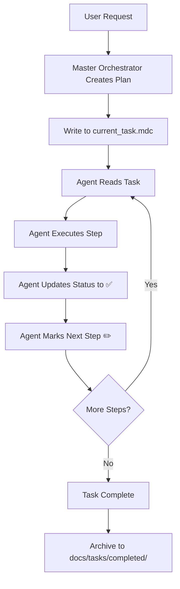

# 📋 Task Tracker - Единая Точка Истины о Плане

**Sanskrit Wisdom**: 🕉️ *"योगः कर्मसु कौशलम्"* (Yogah Karmasu Kaushalam) - "Йога есть искусство в действиях" - Бхагавад-гита 2.50

**Философия**: "current_task - это наша карта. Без карты мы блуждаем в темноте."

## 🎯 Core Knowledge

Этот Skill является аналогом `current_task.mdc` из Cursor Rules и предоставляет:
- 📝 Единую точку истины о текущем плане (Single Source of Truth)
- ✅/✏️/❌ Статусная система для отслеживания прогресса
- 🔄 Автоматическое обновление после каждого действия
- 🔗 Интеграция с Git коммитами
- 🧪 Отслеживание TDD цикла (RED-GREEN-REFACTOR)
- 🕉️ Sanskrit wisdom для духовного наставления

## 📐 Core Principles (from Cursor Rules)

### Principle 1: Read Before Action

```yaml
Правило: "Перед Началом Действия (Чтение Плана)"

Обязательно:
  1. ПРОЧИТАТЬ current_task.mdc
  2. ПОНЯТЬ текущую задачу
  3. ПРОВЕРИТЬ статус предыдущих шагов
  4. ОПРЕДЕЛИТЬ следующее действие

Цель: Избежать повторения работы и дублирования усилий
```

### Principle 2: Update After Action

```yaml
Правило: "После Завершения Действия (Обновление Плана)"

Обязательно:
  1. НЕМЕДЛЕННО обновить current_task.mdc
  2. ИЗМЕНИТЬ статус завершенного шага на ✅
  3. ИЗМЕНИТЬ статус следующего шага на ✏️
  4. ДОБАВИТЬ новые подзадачи если обнаружены

Цель: Сохранить синхронизацию между планом и реальностью
```

### Principle 3: Single Source of Truth

```yaml
Правило: "Единая Точка Истины"

current_task.mdc:
  - ВСЕГДА является актуальным планом
  - НИКОГДА не существует два разных плана
  - ВСЕ агенты читают один и тот же файл
  - ЛЮБЫЕ изменения плана идут ТОЛЬКО через current_task.mdc

Цель: Предотвратить рассинхронизацию и конфликты
```

## 📊 Status System

### Status Emojis

```yaml
✅ (выполнено):
  - Задача полностью завершена
  - Результат проверен
  - Можно переходить к следующему шагу

✏️ (в процессе):
  - Задача начата
  - Работа продолжается
  - НЕ начинать другие задачи параллельно

❌ (требует исправления):
  - Задача выполнена, но есть проблемы
  - Требуется доработка
  - Приоритет для следующего действия
```

## 📝 current_task.mdc Structure

### Template

```markdown
# 🎯 Текущая Задача

**Создано**: 2025-01-11 15:45:00
**Обновлено**: 2025-01-11 16:30:15
**Git Branch**: feat/heygen-wizard
**Git Commit**: 5fe4a1f0 (последний успешный)

## 🕉️ Sanskrit Guidance

*"कर्मण्येवाधिकारस्ते मा फलेषु कदाचन"*
"Твое право - на действие, но никогда - на его плоды" - Бхагавад-гита 2.47

Сосредоточься на процессе, не на результате. Каждый шаг важен.

---

## 📋 План Задачи: Создать HeyGen Avatar Wizard

### Общая Цель
Реализовать полнофункциональный wizard для создания видео с говорящими аватарами через HeyGen API.

### Требования
- Использовать существующие паттерны из neuroPhotoWizard
- Интеграция с Supabase для сохранения результатов
- Inngest для async обработки (генерация может занимать 2-5 минут)
- Обработка ошибок с возвратом средств
- TDD подход (RED-GREEN-REFACTOR)

---

## 📝 Шаги Выполнения

### 1. ✅ Анализ Существующих Паттернов
- ✅ Прочитать neuroPhotoWizard для понимания структуры
- ✅ Изучить Inngest integration patterns
- ✅ Проверить Supabase schema для assets

**Commit**: `abc123` - Analyze existing wizard patterns

### 2. ✏️ Создание Структуры Wizard (СЕЙЧАС)
- ✅ Создать файл `src/scenes/heygenWizard/heygen-avatar-wizard.ts`
- ✏️ Определить интерфейсы WizardState
- ⏸️ Реализовать шаги wizard (selectAvatar, enterText, selectVoice)
- ⏸️ Добавить валидацию на каждом шаге

**TDD Цикл**:
- 🔴 RED: Написать тесты для WizardState interface
- 🟢 GREEN: (следующий шаг)
- 🔵 REFACTOR: (следующий шаг)

### 3. ⏸️ Интеграция с HeyGen API
- ⏸️ Создать `src/services/heygen/client.ts`
- ⏸️ Реализовать `createAvatar()` функцию
- ⏸️ Добавить error handling
- ⏸️ Написать unit tests

**TDD Цикл**: 🔴 RED (ожидание)

### 4. ⏸️ Inngest Function для Async Processing
- ⏸️ Создать `src/inngest/functions/heygen-generate-avatar.ts`
- ⏸️ Реализовать polling для проверки статуса
- ⏸️ Обработка webhook от HeyGen
- ⏸️ Сохранение результата в Supabase

### 5. ⏸️ Финализация и Testing
- ⏸️ E2E тесты в Docker test environment
- ⏸️ Проверка всех error scenarios
- ⏸️ Code review
- ⏸️ Deployment на production

---

## 🔄 История Изменений

### [16:30] Создал структуру wizard файла
- Определил WizardState interface
- Начал работу над шагом 2
- Статус: ✏️ В процессе

### [16:00] Завершил анализ паттернов
- Изучил neuroPhotoWizard
- Понял структуру Inngest integration
- Проверил Supabase schema
- Статус: ✅ Выполнено

### [15:45] Начало задачи
- Создан current_task.mdc
- Определен общий план
- Ветка: feat/heygen-wizard

---

## 📌 Важные Заметки

### Известные Проблемы
- HeyGen API имеет лимит 100 запросов/день (нужно учитывать)
- Webhook может приходить с задержкой до 10 минут

### Зависимости
- Требуется HEYGEN_API_KEY в Infisical
- Требуется обновление Supabase schema (добавить heygen_avatar_id)

### Следующее Действие
**СЕЙЧАС**: Определить WizardState interface и написать для него тесты (TDD RED)
```

## 🔄 Update Workflow

### Pattern 1: Before Starting Work

```typescript
// Pseudo-code workflow
async function beforeStartingWork() {
  // 1. Read current task
  const currentTask = await readFile('current_task.mdc');

  // 2. Check status of previous steps
  const lastStep = findLastCompletedStep(currentTask);

  // 3. Determine next action
  const nextStep = findStepWithStatus(currentTask, '✏️');

  // 4. Proceed with next action
  console.log(`Continuing from: ${nextStep.name}`);
}
```

### Pattern 2: After Completing Action

```typescript
// Pseudo-code workflow
async function afterCompletingAction(stepName: string) {
  // 1. Mark current step as completed
  await updateTaskStatus(stepName, '✅');

  // 2. Add git commit reference
  const commitHash = await getCurrentGitCommit();
  await addCommitToTask(stepName, commitHash);

  // 3. Mark next step as in progress
  const nextStep = getNextStep(stepName);
  await updateTaskStatus(nextStep, '✏️');

  // 4. Add timestamp
  await updateTimestamp();

  // 5. Save changes
  await saveFile('current_task.mdc');
}
```

## 🧪 TDD Integration

### TDD Cycle Tracking

```markdown
### 2. ✏️ Создание Структуры Wizard (СЕЙЧАС)

**TDD Цикл**:
- 🔴 RED: Написать failing test для WizardState
  - Status: ✏️ В процессе
  - Test file: `__tests__/heygen-wizard.test.ts`
  - Command: `npm test -- heygen-wizard`

- 🟢 GREEN: Реализовать минимальный код для прохождения теста
  - Status: ⏸️ Ожидание (зависит от RED)

- 🔵 REFACTOR: Оптимизация и улучшение кода
  - Status: ⏸️ Ожидание (зависит от GREEN)
```

### TDD Status Updates

After each TDD phase:
```bash
# After RED phase
- 🔴 RED: ✅ Test написан и падает (expected)
- 🟢 GREEN: ✏️ Реализация кода (в процессе)

# After GREEN phase
- 🔴 RED: ✅ Test написан и падает
- 🟢 GREEN: ✅ Test проходит
- 🔵 REFACTOR: ✏️ Оптимизация кода (в процессе)

# After REFACTOR phase
- 🔴 RED: ✅ Test написан и падает
- 🟢 GREEN: ✅ Test проходит
- 🔵 REFACTOR: ✅ Код оптимизирован
```

## 🔗 Git Integration

### Git Commit Tracking

```markdown
### 2. ✅ Создание Структуры Wizard
- ✅ Создать файл heygen-avatar-wizard.ts
- ✅ Определить интерфейсы WizardState
- ✅ Реализовать шаги wizard

**Commits**:
- `5fe4a1f0` - Create wizard file structure
- `7a2b8c3d` - Define WizardState interface
- `9e4f5g6h` - Implement wizard steps

**Branch**: feat/heygen-wizard
**Merged to**: production (PR #123)
```

### Rollback Reference

If something goes wrong:
```bash
# Last known good commit for this task
git checkout 5fe4a1f0

# Or rollback to previous step
git reset --hard 7a2b8c3d
```

## 🎭 Integration with Master Orchestrator

### Pattern: Master Orchestrator Creates Task

```yaml
Master Orchestrator:
  1. Receives complex task from user
  2. Creates execution plan
  3. Writes plan to current_task.mdc
  4. Delegates to specialized Skills/Agents
  5. Each agent reads current_task.mdc before acting
  6. Each agent updates current_task.mdc after acting
  7. Master Orchestrator monitors progress through current_task.mdc
```

### Pattern: Task Handoff Between Agents

```yaml
Agent A (telegram-scenes-ULTIMATE):
  - Completes wizard structure
  - Marks step as ✅
  - Marks next step as ✏️ (API integration)
  - Updates current_task.mdc

Agent B (ai-pipeline-orchestration):
  - Reads current_task.mdc
  - Sees "API integration" is ✏️
  - Continues from there
  - Updates current_task.mdc after completion
```

## 📊 Best Practices

### DO:
✅ Read current_task.mdc before EVERY action
✅ Update current_task.mdc after EVERY completed step
✅ Keep single task file (no duplicates)
✅ Add git commit references
✅ Track TDD cycle phases
✅ Add Sanskrit wisdom for spiritual guidance
✅ Use clear status emojis (✅/✏️/❌)

### DON'T:
❌ Skip reading current_task.mdc
❌ Create multiple task tracking files
❌ Leave status outdated
❌ Start work without checking current status
❌ Work on multiple ✏️ tasks simultaneously
❌ Forget to add commit references

## 🚀 Usage Examples

### Example 1: Starting New Complex Task

```bash
# User: "Create HeyGen wizard with full TDD"

# Master Orchestrator:
1. Creates current_task.mdc with full plan
2. Marks first step as ✏️
3. Delegates to telegram-scenes-ULTIMATE

# telegram-scenes-ULTIMATE:
1. Reads current_task.mdc
2. Sees "1. ✏️ Analyze existing patterns"
3. Performs analysis
4. Updates: "1. ✅ Analyze existing patterns"
5. Updates: "2. ✏️ Create wizard structure"
6. Delegates to tdd-test-engineer

# tdd-test-engineer:
1. Reads current_task.mdc
2. Sees "2. ✏️ Create wizard structure" + "TDD Cycle: 🔴 RED"
3. Writes failing test
4. Updates TDD status: "🔴 RED: ✅ Test written"
5. Updates: "TDD Cycle: 🟢 GREEN ✏️"
6. Delegates back to telegram-scenes-ULTIMATE for implementation
```

### Example 2: Recovery After Error

```bash
# Error occurred during "3. Inngest Integration"

# memory-manager agent:
1. Reads current_task.mdc
2. Sees "3. ❌ Inngest Integration (error)"
3. Checks REGRESSION_PATTERNS.md
4. Finds known solution
5. Applies fix
6. Updates: "3. ✅ Inngest Integration (fixed)"
7. Adds commit reference
8. Marks next step as ✏️
```

### Example 3: Checking Progress

```bash
# User: "What's the status of HeyGen wizard?"

# Claude reads current_task.mdc and reports:

"📋 HeyGen Wizard Status:

1. ✅ Analyze existing patterns (Complete)
2. ✅ Create wizard structure (Complete)
3. ✏️ Inngest Integration (In Progress - 60% done)
   - ✅ Create function file
   - ✏️ Implement polling logic
   - ⏸️ Add webhook handling
4. ⏸️ Testing (Not Started)
5. ⏸️ Deployment (Not Started)

Current Branch: feat/heygen-wizard
Last Commit: 7a2b8c3d - Implement polling logic
Next Action: Complete polling logic implementation"
```

## 🎯 File Location

**Primary File**: `current_task.mdc` (в корне проекта)

**Convention**:
- ONE file for current active task
- Archive completed tasks to `docs/tasks/completed/`
- Never have multiple active current_task files

## 🔄 Task Lifecycle



---

**Created**: 2025-01-11
**Version**: 1.0
**Status**: Production-ready ✅
**Philosophy**: "Single Source of Truth prevents chaos"
**Integration**: Works with master-orchestrator, all agents, memory-manager, TDD automation

---

## 🕉️ Final Sanskrit Wisdom

*"श्रेयान्स्वधर्मो विगुणः परधर्मात्स्वनुष्ठितात्"*
"Лучше исполнять свой долг несовершенно, чем чужой - в совершенстве" - Бхагавад-гита 3.35

Каждый агент должен обновлять current_task.mdc - это его долг. Не пропускай этот шаг.
