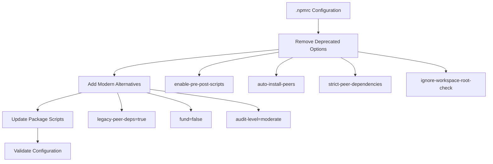

# Fix NPM Configuration Warnings

## Overview

The project is experiencing npm configuration warnings due to deprecated config options in the `.npmrc` file. These deprecated configurations will stop working in the next major version of npm and need to be updated to use modern alternatives.

## Current Issues

The following npm configuration warnings are appearing:
- `Unknown project config "enable-pre-post-scripts"`
- `Unknown project config "auto-install-peers"`  
- `Unknown project config "strict-peer-dependencies"`
- `Unknown project config "ignore-workspace-root-check"`

## Architecture

### Current Configuration Structure

The project uses a `.npmrc` file in the root directory with the following deprecated configurations:

```
enable-pre-post-scripts=false
auto-install-peers=true
strict-peer-dependencies=false
ignore-workspace-root-check=true
```

### Migration Strategy

#### Configuration Mapping

| Deprecated Option | Modern Alternative | Action Required |
|-------------------|-------------------|------------------|
| `enable-pre-post-scripts` | Default npm behavior | Remove (npm 7+ enables by default) |
| `auto-install-peers` | Manual peer dependency management | Remove and update package.json |
| `strict-peer-dependencies` | `legacy-peer-deps` flag | Update to use `legacy-peer-deps=true` |
| `ignore-workspace-root-check` | Workspace configuration | Remove and configure workspace properly |

#### Updated Configuration Structure



## Configuration Updates

### .npmrc File Changes

**Remove deprecated options:**
- `enable-pre-post-scripts=false` - npm 7+ enables pre/post scripts by default
- `auto-install-peers=true` - deprecated in favor of manual peer dependency management
- `strict-peer-dependencies=false` - replaced with `legacy-peer-deps`
- `ignore-workspace-root-check=true` - workspace handling improved in modern npm

**Add modern alternatives:**
- `legacy-peer-deps=true` - maintains compatibility with older peer dependency resolution
- `fund=false` - suppress funding messages (optional)
- `audit-level=moderate` - set appropriate security audit level

### Package.json Script Updates

Update package.json scripts to handle peer dependencies explicitly:

```json
{
  "scripts": {
    "install:clean": "rm -rf node_modules package-lock.json && npm install",
    "install:legacy": "npm install --legacy-peer-deps",
    "audit:fix": "npm audit fix --audit-level=moderate"
  }
}
```

### Migration Implementation

#### Phase 1: Configuration Cleanup
1. Update `.npmrc` with modern configuration options
2. Remove deprecated settings
3. Add compatibility flags for peer dependencies

#### Phase 2: Dependency Management
1. Clean node_modules and package-lock.json
2. Reinstall dependencies with new configuration
3. Verify all dependencies resolve correctly

#### Phase 3: Validation
1. Run npm install to test new configuration
2. Verify no warning messages appear
3. Test all npm scripts functionality
4. Validate project builds successfully

## Testing Strategy

### Configuration Validation Tests

```bash
# Test npm configuration
npm config list

# Verify no warnings during install
npm install --dry-run

# Test package scripts
npm run build
npm run test
npm run dev
```

### Compatibility Testing

| Test Case | Command | Expected Result |
|-----------|---------|----------------|
| Clean Install | `npm ci` | No warnings, successful install |
| Development Setup | `npm run dev` | Application starts without config warnings |
| Production Build | `npm run build:production` | Build completes successfully |
| Dependency Audit | `npm audit` | Audit runs with configured level |

## Implementation Steps

1. **Backup Current Configuration**
   - Create backup of existing `.npmrc`
   - Document current dependency versions

2. **Update .npmrc File**
   - Remove all deprecated configuration options
   - Add modern alternatives for peer dependency handling
   - Set appropriate audit and funding preferences

3. **Clean Installation**
   - Remove `node_modules` and `package-lock.json`
   - Run fresh `npm install` with new configuration
   - Verify no warnings appear

4. **Validate Functionality**
   - Test all npm scripts defined in package.json
   - Verify application builds and runs correctly
   - Run test suite to ensure no regressions

5. **Update Documentation**
   - Update README with new npm requirements
   - Document any changes in development workflow
   - Add troubleshooting guide for dependency issues


