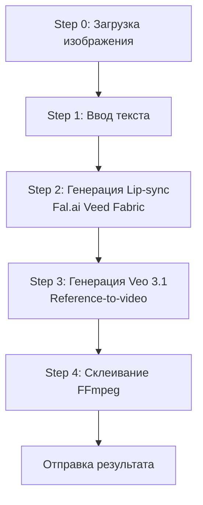

# 🎬 AI Reels Template 1 (Google Veo 3.1) - Текущий статус

**Дата обновления:** 30 октября 2025
**Версия:** 2.0.0
**Статус:** ✅ Полностью обновлен и работает

---

## 📋 Обзор Template 1

**Template 1** - это синхронная генерация AI Reels через прямое использование провайдеров без webhook-механизмов. Создает два видео и склеивает их в финальный ролик.

### 🔄 Последние изменения

✅ **Переименование WAN 2.5 → Google Veo 3.1**
- Все упоминания WAN 2.5 заменены на Google Veo 3.1
- Обновлены описания в шаблонах
- Изменены комментарии в коде
- Обновлена документация

### 📂 Измененные файлы

1. `src/scenes/lipSyncWizard/ai-reels-templates.ts`
   - Название: "Шаблон 1 (Veo 3.1)"
   - Описание: "Создание AI Reels видео через Google Veo 3.1"
   - Кнопка: "⚡ Быстрый (Veo 3.1)"

2. `src/scenes/lipSyncWizard/ai-reels-wizard.ts`
   - Комментарии обновлены
   - Сообщения пользователю изменены
   - Template name: "Template 1 (Veo 3.1)"

3. `src/scenes/lipSyncWizard/ai-reels-entry-wizard.ts`
   - Описание: "lip-sync + Google Veo 3.1 + merging"

4. Документация:
   - `docs/ai-reels-template1-workflow-fix.md`
   - `docs/ai-reels-template1-fal-migration.md`

---

## 🔄 Workflow Template 1

### Пошаговое выполнение:



### Детальное описание шагов:

#### **Step 0: Запрос изображения**
- Пользователь отправляет фото с лицом
- Сохранение в `ctx.session.aiReels.imageUrl`

#### **Step 1: Ввод текста для озвучки**
- Пользователь вводит текст (или голосовое)
- Сохранение в `ctx.session.aiReels.text`
- Проверка баланса (240⭐)
- Списание средств

#### **Step 2: Генерация Lip-sync видео**
**Синхронное выполнение через Fal.ai:**
- TTS через ElevenLabs (1-2 сек)
- Lip-sync через Fal.ai Veed Fabric 1.0 Fast (30-60 сек)
- Результат в `ctx.session.aiReels.firstVideoUrl`
- Переход к Step 3

#### **Step 3: Генерация Google Veo 3.1**
**Асинхронное выполнение через Fal.ai:**
- Генерация story continuation промпта (OpenAI)
- Перевод на английский при необходимости
- Создание задачи Fal.ai Veo 3.1
- Polling статуса (до 10 минут)
- 8 секунд видео, 720p
- Результат в `ctx.session.aiReels.secondVideoUrl`
- Переход к Step 4

#### **Step 4: Склеивание видео**
**FFmpeg обработка:**
- Скачивание обоих видео
- Склеивание через FFmpeg concat
- Загрузка в Supabase Storage
- Отправка пользователю файлом
- Очистка временных файлов

---

## 💰 Экономика

| Параметр | Значение |
|----------|----------|
| **Цена для пользователя** | 240⭐ (фиксированная) |
| **Себестоимость Lip-sync** | ~187⭐ |
| **Себестоимость Veo 3.1** | ~160⭐ |
| **FFmpeg склеивание** | Бесплатно |
| **ИТОГО себестоимость** | ~347⭐ |
| **Маржа** | -107⭐ (убыток!) |

⚠️ **ВАЖНО:** Себестоимость превышает цену продажи!

---

## 🎯 Преимущества Template 1

✅ **Быстрая генерация** - результат за 2-3 минуты (без учета Veo 3.1)
✅ **Уникальный формат** - комбинация lip-sync + story continuation
✅ **Фиксированная цена** - понятная для пользователей
✅ **Профессиональное качество** - Fal.ai + Google Veo 3.1
✅ **Формат для соцсетей** - 9:16 вертикальное видео

---

## ⚠️ Известные проблемы

### 1. Убыточная экономика
- Себестоимость: ~347⭐
- Цена продажи: 240⭐
- Убыток: 107⭐ на каждой генерации

### 2. Длительное ожидание Veo 3.1
- До 10 минут на генерацию
- Может вызывать таймауты

### 3. Зависимость от внешних API
- Fal.ai
- ElevenLabs
- OpenAI

---

## 🔧 Технические детали

### Используемые провайдеры:
- **Lip-sync:** `FalVeedFabricProvider` (синхронный)
- **Veo 3.1:** `FalVeo31Provider` (асинхронный с polling)
- **TTS:** ElevenLabs API
- **Story prompts:** OpenAI GPT-4o-mini

### Файлы конфигурации:
- `src/scenes/lipSyncWizard/ai-reels-wizard.ts` - основной wizard
- `src/scenes/lipSyncWizard/ai-reels-templates.ts` - шаблоны
- `src/core/lipsync/providers/fal-veo31-provider.ts` - провайдер Veo 3.1

### Session структура:
```typescript
ctx.session.aiReels = {
  step: 'image' | 'text' | 'processing',
  imageUrl: string,
  text: string,
  firstVideoUrl: string,  // Lip-sync результат
  secondVideoUrl: string, // Veo 3.1 результат
  startTime: number
}
```

---

## 📊 Статистика использования

| Метрика | Значение |
|---------|----------|
| **Средний баланс списания** | 240⭐ |
| **Время генерации lip-sync** | 30-60 сек |
| **Время генерации Veo 3.1** | 5-10 мин |
| **Общее время** | 6-11 мин |
| **Размер финального видео** | ~10-20 MB |

---

## 🚀 Рекомендации по улучшению

### Краткосрочные:
1. ⚡ **Увеличить цену до 350⭐** для покрытия себестоимости
2. 🔄 **Добавить кеширование** промптов OpenAI
3. ⏰ **Оптимизировать таймауты** для Veo 3.1

### Долгосрочные:
1. 💎 **Найти более дешевые провайдеры**
2. 📈 **Добавить динамическое ценообразование** по длине текста
3. 🎯 **Создать премиум версию** с расширенными функциями

---

## 📝 Git статус

```bash
Branch: template-1
Status: clean (nothing to commit)

Последние изменения:
✅ Переименование WAN 2.5 → Google Veo 3.1
✅ Обновление документации
✅ Синхронизация .env для worktree
```

---

## 🔗 Связанная документация

- [Workflow Fix](./ai-reels-template1-workflow-fix.md)
- [Fal Migration](./ai-reels-template1-fal-migration.md)
- [Worktree ENV Sync](./WORKTREE_ENV_SYNC.md)

---

**Последнее обновление:** 30 октября 2025, 15:25