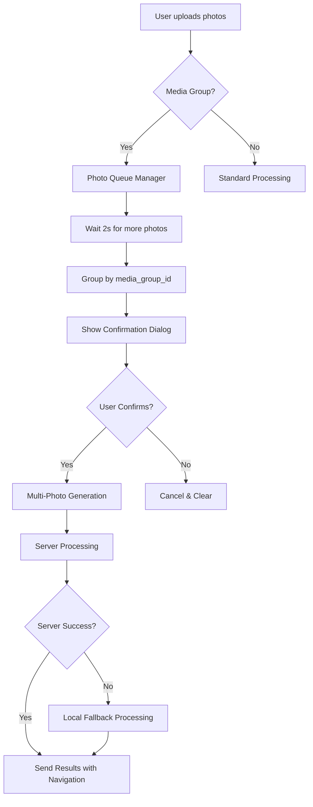

# Multi-Photo Neurophoto Enhancement 🎨📸

## Overview

The Multi-Photo Neurophoto feature enhances the existing neurophoto functionality to support processing multiple images simultaneously. Users can now upload an album (media group) of photos and generate a series of neurophotos with consistent styling and prompts.

## Key Features

### 🔄 Automatic Detection
- **Media Group Detection**: Automatically detects when users send multiple photos as an album
- **Sequential Upload Handling**: Manages photos sent one after another within a time window
- **Smart Queuing**: Groups related photos and processes them as a batch

### 💫 Enhanced Generation
- **Batch Processing**: Processes multiple input images efficiently
- **Consistent Styling**: Applies the same prompt and model to all images in a series
- **Cost Optimization**: Accurate pricing calculation for multiple images (7.5⭐ per image)
- **Progress Tracking**: Real-time updates during multi-image processing

### 🎯 User Experience
- **Confirmation Dialog**: Shows preview of batch operation with cost breakdown
- **Enhanced Navigation**: Browse through generated series with previous/next controls
- **Flexible Input**: Supports both single images and multi-image albums seamlessly

## Technical Architecture

### Core Components

#### 1. Multi-Photo Handler (`/src/handlers/multiPhotoHandler.ts`)
```typescript
// Queue manager for handling multiple photo uploads
class PhotoQueueManager {
  - Manages photo queues per user
  - Handles timing for batch processing
  - Groups photos by media_group_id
}

// Detection and processing functions
detectMultiPhotoUpload(): boolean
handleMultiPhotoNeurophoto(): Promise<void>
checkMultiPhotoEvents(): Promise<boolean>
```

#### 2. Enhanced Generation Service (`/src/services/generateNeuroPhotoMulti.ts`)
```typescript
// Multi-image generation with fallback support
generateNeuroPhotoMulti(
  prompt: string,
  model_url: ModelUrl,
  numImages: number,
  telegram_id: string,
  ctx: MyContext,
  botName: string,
  explicitAspectRatio?: string,
  imageUrls?: string[] // NEW: Multiple input images
): Promise<GenerationResult>
```

#### 3. Action Handlers (`/src/handlers/multiPhotoActions.ts`)
```typescript
// Callback handlers for user interactions
- multi_neurophoto_{userId}_{count}: Confirmation handler
- multi_neurophoto_cancel: Cancellation handler
- new_multi_neurophoto: New series handler
- multi_neurophoto_nav_{index}: Navigation handler
```

#### 4. Enhanced Scene Integration
- Updated `neuroPhotoWizardV2` to detect and route multi-photo requests
- Enhanced session management for multi-photo state
- Seamless integration with existing single-photo workflow

### Data Flow



## Usage Examples

### Single Photo (Backward Compatible)
```typescript
// Existing workflow unchanged
User sends: [single photo]
System: Detects single upload
Processing: Uses existing generateNeuroPhotoHybrid()
Result: Single neurophoto generated
```

### Multi-Photo Album
```typescript
// New enhanced workflow
User sends: [photo1, photo2, photo3] as album
System: Detects media_group_id
Queue: Groups photos together
Confirmation: Shows "3 images, 22.5⭐ total cost"
Processing: Uses generateNeuroPhotoMulti() with imageUrls array
Result: 3 neurophotos with enhanced navigation
```

### Sequential Multi-Upload
```typescript
// Smart time-based grouping
User sends: photo1 (timestamp: 100)
User sends: photo2 (timestamp: 150)
User sends: photo3 (timestamp: 200)
System: Waits 2s after last photo
Processing: Groups all three for batch processing
```

## Configuration

### Session Interface Extensions
```typescript
interface MySession {
  // Multi-photo neurophoto fields
  multiPhotoUrls?: string[] // URLs of input photos
  multiPhotoCount?: number // Number of photos in batch
  awaitingMultiPhotoConfirmation?: boolean // Confirmation state
  multiPhotoProcessingIndex?: number // Current processing index
}
```

### Queue Settings
```typescript
const PROCESSING_DELAY = 2000 // Wait time for additional photos (ms)
const MAX_PHOTOS_PER_BATCH = 10 // Maximum photos in one batch
const COST_PER_IMAGE = 7.5 // Stars cost per generated image
```

## Error Handling

### Robust Failure Management
- **Server Timeout**: Automatic fallback to local processing
- **NSFW Detection**: Graceful rejection with user notification
- **File Access Errors**: Individual photo error handling
- **Payment Issues**: Clear cost breakdown and validation
- **Session Corruption**: Auto-cleanup and recovery

### Validation Chain
1. **Upload Validation**: Verify photo access and URLs
2. **Cost Validation**: Confirm user balance for total cost
3. **Model Validation**: Ensure compatible model and settings
4. **Processing Validation**: Handle server/local failures gracefully

## Performance Optimizations

### Intelligent Processing
- **Batch API Calls**: Single server request for entire batch
- **Parallel Processing**: Concurrent local fallback processing
- **Memory Management**: Efficient handling of multiple image URLs
- **Progress Updates**: Real-time status for long operations

### Caching & Queue Management
- **Photo URL Caching**: Temporary storage of Telegram file URLs
- **Session Persistence**: Reliable state management across interactions
- **Queue Cleanup**: Automatic cleanup of expired photo queues

## Integration Points

### Bot Registration
```typescript
// In registerCommands.ts
import { registerMultiPhotoActions } from './handlers/multiPhotoActions'

export function registerCommands({ bot }) {
  // ... existing setup

  // Register multi-photo handlers
  registerMultiPhotoActions(bot)
}
```

### PhotoHandler Integration
```typescript
// Enhanced PhotoHandler with multi-photo support
private initializePhotoHandlers(): void {
  this.photoHandlers.push({
    condition: (ctx) => {
      return ctx.scene?.current?.id === 'neuro_photo_v2' ||
             ctx.session?.awaitingMultiPhotoConfirmation ||
             ('media_group_id' in ctx.message && !!ctx.message.media_group_id)
    },
    handler: async (ctx) => {
      const isMultiPhoto = await detectMultiPhotoUpload(ctx)
      // Handle accordingly...
    },
    priority: 200 // Highest priority
  })
}
```

## Server-Side Requirements

### API Endpoint Enhancement
```typescript
// NEW: Multi-image endpoint
POST /generate/neuro-photo-multi
{
  prompt: string,
  model_url: ModelUrl,
  num_images: number,
  telegram_id: string,
  is_multi_image: boolean,
  input_image_urls: string[],
  actual_image_count: number,
  exact_total_cost: number
}
```

### Response Format
```typescript
// Enhanced response with batch support
{
  success: boolean,
  urls: string[], // Array of generated image URLs
  processedCount: number,
  jobId?: string, // For async processing
  error?: string
}
```

## Testing Strategy

### Comprehensive Test Coverage
- **Unit Tests**: Individual component testing
- **Integration Tests**: End-to-end workflow testing
- **Error Scenario Tests**: Failure case handling
- **Performance Tests**: Batch processing efficiency
- **Regression Tests**: Backward compatibility verification

### Test Scenarios
1. **Single Photo Processing**: Verify no regression
2. **Multi-Photo Album**: Complete workflow testing
3. **Sequential Upload**: Time-based grouping verification
4. **Error Handling**: Server failures, NSFW content, etc.
5. **Cost Calculation**: Accurate pricing for multiple images
6. **Session Management**: State persistence across interactions

## Deployment Notes

### Production Considerations
- **Docker Rebuild Required**: Full container rebuild with `--no-cache`
- **Session Migration**: Existing sessions compatible (no breaking changes)
- **Server API**: Deploy enhanced endpoint for optimal performance
- **Monitoring**: Track multi-photo usage and performance metrics

### Rollback Strategy
- **Feature Toggle**: Can disable multi-photo detection if needed
- **Graceful Degradation**: Falls back to single-photo processing
- **Session Cleanup**: Automatic cleanup of multi-photo session data

## Usage Analytics

### Metrics to Track
- **Multi-Photo Adoption**: Percentage of users using multi-photo feature
- **Batch Size Distribution**: Average number of photos per batch
- **Cost Impact**: Revenue per multi-photo session
- **Processing Performance**: Server vs local processing success rates
- **User Satisfaction**: Feature usage retention and feedback

## Future Enhancements

### Planned Improvements
- **Custom Batch Sizes**: Allow users to generate N images per input photo
- **Style Mixing**: Different styles per image in batch
- **Advanced Navigation**: Gallery view for large batches
- **Batch Templates**: Saved prompt templates for series
- **Cross-Session Batches**: Resume incomplete batch processing

### Technical Roadmap
- **WebSocket Support**: Real-time progress updates
- **CDN Integration**: Faster image delivery for results
- **Advanced Queuing**: Priority queuing for premium users
- **Batch Optimization**: ML-based batch processing optimization

---

**Implementation Status**: ✅ Complete and Ready for Production

**Next Steps**:
1. Deploy server-side API enhancements
2. Monitor production usage patterns
3. Gather user feedback for future improvements