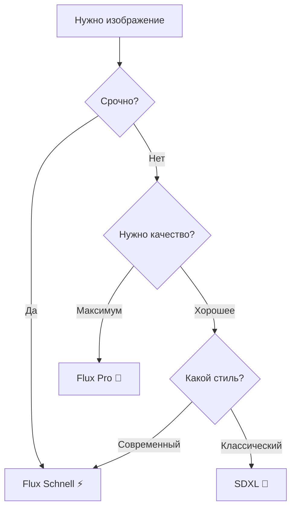

# 🎨 AI Модели - Шпаргалка

## Доступные модели

### ⚡️ Flux Schnell (ПО УМОЛЧАНИЮ)
```
ID: black-forest-labs/flux-schnell
Время: 10-20 сек
Качество: ⭐️⭐️⭐️⭐️
Стоимость: 💰
```
**Когда использовать**: Для 90% задач. Быстро и качественно.

**Примеры**:
- Общие сцены
- Портреты
- Пейзажи
- Объекты
- Иллюстрации

---

### 💎 Flux Pro
```
ID: black-forest-labs/flux-pro
Время: 30-60 сек
Качество: ⭐️⭐️⭐️⭐️⭐️
Стоимость: 💰💰💰
```
**Когда использовать**: Когда нужен WOW-эффект.

**Примеры**:
- Профессиональные рендеры
- Детализированные сцены
- Коммерческая графика
- Арт для портфолио

---

### 🎯 SDXL
```
ID: stability-ai/sdxl:latest
Время: 20-40 сек
Качество: ⭐️⭐️⭐️⭐️
Стоимость: 💰💰
```
**Когда использовать**: Для классических стилей.

**Примеры**:
- Реалистичные фото
- Классическое искусство
- Предсказуемые результаты

---

## 🎯 Алгоритм выбора модели



---

## 📊 Сравнительная таблица

| Модель | Скорость | Качество | Детали | Цена | Рекомендация |
|--------|----------|----------|--------|------|--------------|
| **Flux Schnell** | ⚡️⚡️⚡️ | ⭐️⭐️⭐️⭐️ | 👍👍👍 | 💰 | **90% задач** |
| **Flux Pro** | ⚡️ | ⭐️⭐️⭐️⭐️⭐️ | 👍👍👍👍👍 | 💰💰💰 | Важные проекты |
| **SDXL** | ⚡️⚡️ | ⭐️⭐️⭐️⭐️ | 👍👍👍👍 | 💰💰 | Классика |

---

## 🎨 Что генерирует каждая модель лучше всего

### Flux Schnell ⚡️
```
✅ Портреты людей
✅ Природа и пейзажи
✅ Современные сцены
✅ Фантастика
✅ Абстракция
✅ Иллюстрации
```

### Flux Pro 💎
```
✅ Фотореализм
✅ Сложные композиции
✅ Архитектура
✅ Детальные текстуры
✅ Профессиональная графика
✅ Концепт-арт
```

### SDXL 🎯
```
✅ Реалистичные фото
✅ Классическое искусство
✅ Традиционные стили
✅ Стабильные результаты
✅ Предсказуемость
```

---

## 💡 Практические советы

### Для Flux Schnell:
```
• Пишите детальные промпты
• Указывайте стиль (киберпанк, фэнтези, реализм)
• Описывайте освещение (мягкий свет, закат, неон)
• Добавляйте настроение (уютный, драматичный, спокойный)
```

### Для Flux Pro:
```
• Очень детальные промпты (15+ слов)
• Указывайте камеру (DSLR, 50mm, cinematic)
• Описывайте материалы (дерево, металл, стекло)
• Добавляйте технические термины (depth of field, bokeh)
```

### Для SDXL:
```
• Классические описания
• Художественные термины
• Стили известных художников
• Традиционные композиции
```

---

## 🔧 Как менять модель (в будущем)

**Phase 2 плагина** добавит:
```typescript
// Команда с выбором модели
/neurophoto model:flux-pro закат над океаном

// Или настройка по умолчанию
.env:
DEFAULT_MODEL=black-forest-labs/flux-pro
```

---

## 📈 Статистика использования

### Рекомендуемое распределение:

```
🎨 Flux Schnell: 85% запросов
  └─ Быстрые тесты, итерации, общие задачи

💎 Flux Pro: 10% запросов
  └─ Важные проекты, финальные рендеры

🎯 SDXL: 5% запросов
  └─ Специфичные классические стили
```

---

## 🎓 Примеры промптов для каждой модели

### Flux Schnell:
```
нарисуй уютную кофейню с мягким светом, деревянная мебель, утро

create a futuristic city at night, neon lights, cyberpunk style

покажи кота в космическом шлеме, звёзды на фоне, sci-fi
```

### Flux Pro:
```
professional product photography of luxury watch, studio lighting,
black background, macro lens, reflections on metal surface,
high detail, commercial quality

архитектурная визуализация современного дома, стекло и бетон,
вечернее освещение, минимализм, фотореалистичный рендер,
профессиональная архитектурная фотография
```

### SDXL:
```
portrait of a woman in Renaissance style, oil painting,
classical composition, soft lighting, inspired by Rembrandt

пейзаж в стиле импрессионизм, закат, мазки кисти,
классическая живопись, яркие цвета
```

---

**Текущая версия**: 0.1.0
**Используется по умолчанию**: Flux Schnell ⚡️
**Обновлено**: 2025-01-12
