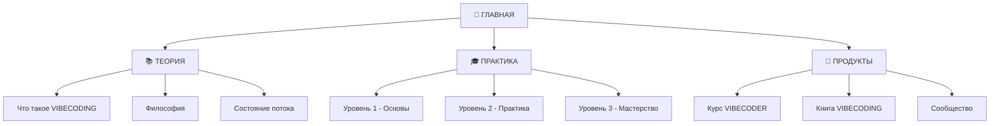

![[ComfyUI_00001_ (1).png]]
# 🎯 НАВИГАЦИЯ ПО ПРОЕКТУ VIBECODING

*Добро пожаловать в мир программирования с ИИ*

---

## 📖 ГЛАВНЫЕ ФАЙЛЫ

### 🏠 [[README]] — НАЧНИТЕ ЗДЕСЬ
**Главное руководство** — краткое и практичное введение в VIBECODING

### 📚 [[📚 VIBECODING - Полная книга]] — ДЕТАЛЬНАЯ КНИГА
**Полное руководство** — вся информация о VIBECODING

### 🔥 [[🔥 ЛЕНДИНГ - VIBECODER]] — КУРС И МЕНТОРСТВО
**Продающая страница** — курс VIBECODER с персональным наставничеством ($3,500)

---

## 📜 ИСТОРИЯ ДВИЖЕНИЯ

### 🎯 Рождение концепции
**Февраль 2025** - Андрей Карпати (сооснователь OpenAI) вводит термин **"vibe coding"**:

> *"There's a new kind of coding I call 'vibe coding', where you fully give in to the vibes, embrace exponentials, and forget that the code even exists... It's not really coding - I just see stuff, say stuff, run stuff, and copy paste stuff, and it mostly works."*

### 🌟 Развитие философии
**НейроКодер** развил идею Карпати в целостную **философию и методологию VIBECODING**:

### 📝 В НАЧАЛЕ БЫЛО СЛОВО
**VIBECODING** — это программирование **силой слова**, где:
- 🗣️ **Код создается через промпты**, а не руками
- 💭 **Программы рождаются из описаний**, а не алгоритмов
- 🎨 **Творчество выражается словами**, а не синтаксисом
- 🌊 **Интуиция направляет ИИ**, а не логические конструкции

> *"Если ты пишешь код руками — это уже не вайб-кодинг"* — НейроКодер

### 🌍 Глобальное признание
- **Март 2025** - термин в словаре Merriam-Webster
- **Википедия** - статья на 24 языках мира
- **25% стартапов Y Combinator** используют AI-генерированный код

**📜 Подробнее:** [📜 История VIBECODING](../01%20-%20ТЕОРИЯ/📜%20История%20VIBECODING.md)

---

## 🌟 БЫСТРЫЙ СТАРТ

### 📚 Изучение
- [[📖 Что такое VIBECODING]]
- [[🧠 Философия интуитивного программирования]]
- [[📝 Сила Слова в программировании]]

### 🎓 Обучение
- [[🚀 Начните свое путешествие]]
- [[🗺️ Карта обучения VIBECODING]]
- [[📊 Пройдите оценку уровня]]

### 💎 Продукты
- [[💰 Курс VIBECODER - Годовая подписка]]
- [[📱 Telegram-бот для обучения]]

---

## 🔗 СВЯЗИ В ГРАФЕ ЗНАНИЙ

---

## 🎯 ЦЕЛИ ПРОЕКТА

1. **Трансформация индустрии** - изменить подход к программированию
2. **Возвращение радости** - сделать кодинг снова увлекательным
3. **Повышение качества** - создавать более элегантный код
4. **Развитие сообщества** - объединить единомышленников

---

## 🔥 АКТУАЛЬНЫЕ ЗАДАЧИ

- [ ] Запуск курса VIBECODER для первых 5 студентов
- [ ] Создание Telegram-бота для обучения
- [ ] Разработка лендинга с НейроКодером
- [ ] Публикация книги VIBECODING
- [ ] Формирование VIP-сообщества

---

---

## 📞 Контакты

**Автор:** НейроКодер
**Контакт:** [@neuro_sage](https://t.me/neuro_sage)
**Проект:** VIBECODING Guide

*Последнее обновление: 2025 | Автор: НейроКодер*
