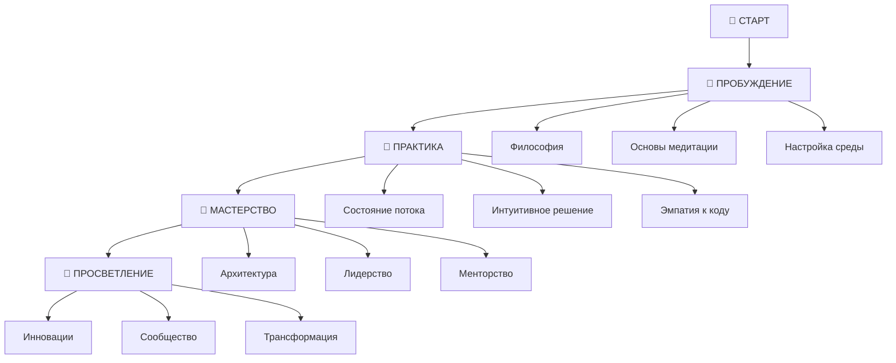

# 🗺️ Карта обучения VIBECODING

*Визуальный путеводитель по трансформации в вайб-кодера*

---

## 🌟 ОБЗОР ПУТЕШЕСТВИЯ

Ваше путешествие в мир интуитивного программирования состоит из **4 основных этапов**, каждый из которых трансформирует ваш подход к коду и жизни.

---

## 🌱 ЭТАП 1: ПРОБУЖДЕНИЕ (1-3 месяца)

### 🎯 Цель этапа
Осознать возможность другого подхода к программированию и заложить философские основы.

### 📚 Ключевые материалы
1. **[[📖 Что такое VIBECODING]]** *(2 недели)*
   - Понимание основных принципов
   - Отличия от традиционного подхода
   - Преимущества интуитивного программирования

2. **[[🧠 Философия интуитивного программирования]]** *(2 недели)*
   - Глубинные принципы VIBECODING
   - Трансформация сознания разработчика
   - Архетипы программистов

3. **[[🧘 Основы медитации для программистов]]** *(4 недели)*
   - Техники осознанности
   - Медитация перед кодингом
   - Дыхательные практики

4. **[[⚙️ Настройка идеального рабочего места]]** *(2 недели)*
   - Физическая среда для потока
   - Цифровые инструменты
   - Атмосфера и настроение

### 🎯 Практические задания
- [ ] Ежедневная 10-минутная медитация
- [ ] Настройка рабочего места по принципам VIBECODING
- [ ] Ведение дневника ощущений от кодинга
- [ ] Первые эксперименты с интуитивным подходом

### ✅ Критерии завершения
- Понимание философии VIBECODING
- Регулярная практика медитации
- Настроенное рабочее место
- Первые изменения в подходе к коду

---

## 🌿 ЭТАП 2: ПРАКТИКА (3-6 месяцев)

### 🎯 Цель этапа
Освоить практические техники интуитивного программирования и научиться входить в состояние потока.

### 📚 Ключевые материалы
1. **[[🌊 Состояние потока в разработке]]** *(4 недели)*
   - Техники входа в поток
   - Поддержание глубокой концентрации
   - Работа с отвлекающими факторами

2. **[[🎨 Интуитивное решение проблем]]** *(4 недели)*
   - Творческие техники в программировании
   - Использование правого полушария мозга
   - Генерация нестандартных решений

3. **[[👁️ Эмпатическое чтение кода]]** *(3 недели)*
   - Понимание намерений автора
   - Чувствование "настроения" кода
   - Интуитивная отладка

4. **[[🔄 Ритмы и циклы разработки]]** *(3 недели)*
   - Работа с биоритмами
   - Планирование по энергетическим циклам
   - Техники восстановления

### 🎯 Практические задания
- [ ] Ежедневные сессии в состоянии потока (минимум 1 час)
- [ ] Решение задач через интуитивные техники
- [ ] Анализ чужого кода на эмпатическом уровне
- [ ] Создание персонального ритма разработки

### ✅ Критерии завершения
- Способность входить в поток по желанию
- Использование интуиции для решения проблем
- Понимание кода на эмоциональном уровне
- Оптимизированный личный ритм работы

---

## 🌳 ЭТАП 3: МАСТЕРСТВО (6-12 месяцев)

### 🎯 Цель этапа
Достичь уровня мастера вайб-кодинга и начать влиять на других разработчиков.

### 📚 Ключевые материалы
1. **[[🏗️ Интуитивная архитектура]]** *(6 недель)*
   - Проектирование систем "от чувства"
   - Эволюционная архитектура
   - Паттерны, которые "ощущаются правильно"

2. **[[🤝 Командный вайб-кодинг]]** *(4 недели)*
   - Синхронизация с командой
   - Передача "вайба" через код
   - Коллективное состояние потока

3. **[[🔮 Предвидение и планирование]]** *(4 недели)*
   - Интуитивное планирование проектов
   - Предчувствование проблем
   - Стратегическое мышление

4. **[[🎓 Основы менторства]]** *(4 недели)*
   - Передача знаний VIBECODING
   - Вдохновение других разработчиков
   - Создание культуры осознанного программирования

### 🎯 Практические задания
- [ ] Проектирование архитектуры интуитивным методом
- [ ] Ведение команды через принципы VIBECODING
- [ ] Менторство младших разработчиков
- [ ] Создание инновационного проекта

### ✅ Критерии завершения
- Способность создавать элегантные архитектуры
- Лидерство в команде через VIBECODING
- Успешное менторство других
- Признание экспертизы коллегами

---

## 🌟 ЭТАП 4: ПРОСВЕТЛЕНИЕ (12+ месяцев)

### 🎯 Цель этапа
Стать просветленным программистом и трансформатором индустрии.

### 📚 Ключевые материалы
1. **[[🌌 Глубокие состояния сознания]]** *(8 недель)*
   - Продвинутые медитативные техники
   - Программирование в измененных состояниях
   - Канальное кодирование

2. **[[💡 Инновационное мышление]]** *(6 недель)*
   - Создание прорывных решений
   - Выход за рамки привычного
   - Интеграция искусства и технологий

3. **[[🌍 Трансформация индустрии]]** *(6 недель)*
   - Влияние на культуру разработки
   - Создание движения VIBECODING
   - Изменение парадигм программирования

4. **[[🎭 Мастер-класс по обучению]]** *(6 недель)*
   - Создание собственных курсов
   - Публичные выступления
   - Написание книг и статей

### 🎯 Практические задания
- [ ] Создание инновационного продукта
- [ ] Публичное выступление о VIBECODING
- [ ] Написание статьи или книги
- [ ] Формирование сообщества единомышленников

### ✅ Критерии завершения
- Естественное состояние потока в работе
- Способность вдохновлять и трансформировать других
- Создание значимого вклада в индустрию
- Признание как эксперта в VIBECODING

---

## 🎯 ПЕРСОНАЛЬНЫЕ ТРЕКИ

### 🚀 Быстрый трек (6 месяцев)
Для опытных разработчиков с высокой мотивацией:
- Интенсивное изучение (20+ часов в неделю)
- Ежедневная практика медитации
- Еженедельные проекты
- Менторство с первого месяца

### 🌱 Комфортный трек (12 месяцев)
Для сбалансированного развития:
- Умеренное изучение (10-15 часов в неделю)
- Регулярная практика
- Месячные проекты
- Постепенное углубление

### 🐌 Медленный трек (24 месяца)
Для глубокого погружения:
- Неспешное изучение (5-10 часов в неделю)
- Акцент на философии и практиках
- Квартальные проекты
- Максимальная интеграция в жизнь

---

## 📊 СИСТЕМА ПРОГРЕССА

### 🏆 Достижения
- **🌱 Пробужденный** - завершение 1 этапа
- **🌿 Практик** - завершение 2 этапа  
- **🌳 Мастер** - завершение 3 этапа
- **🌟 Гуру** - завершение 4 этапа

### 📈 Метрики развития
- Время в состоянии потока (часы/день)
- Качество архитектурных решений (1-10)
- Влияние на команду (отзывы коллег)
- Вклад в сообщество (проекты, статьи)

### 🎯 Промежуточные цели
- Еженедельные практические задания
- Ежемесячные проекты
- Квартальные оценки прогресса
- Годовые достижения

---

## 🛠️ ИНСТРУМЕНТЫ ПОДДЕРЖКИ

### 📱 Цифровые помощники
- **[[📱 Telegram-бот]]** - ежедневная поддержка
- **Трекер потока** - мониторинг состояний
- **Дневник вайб-кодера** - рефлексия и анализ

### 👥 Сообщество
- **Группы по уровням** - общение с равными
- **Менторские пары** - персональная поддержка
- **Проектные команды** - совместная практика

### 📚 Ресурсы
- **Библиотека материалов** - структурированные знания
- **Видео-курсы** - визуальное обучение
- **Подкасты** - обучение в движении

---

## 🚀 НАЧНИТЕ ПРЯМО СЕЙЧАС

### 1. 📊 Определите уровень
Пройдите [[📊 Оценку уровня VIBECODING]]

### 2. 🎯 Выберите трек
Определите комфортный темп обучения

### 3. 📚 Начните изучение
Переходите к первому материалу вашего этапа

### 4. 🤝 Присоединитесь к сообществу
Найдите единомышленников и наставников

---

*"Карта не территория, но без карты легко заблудиться в пути"*

**— Древняя мудрость вайб-кодеров**
