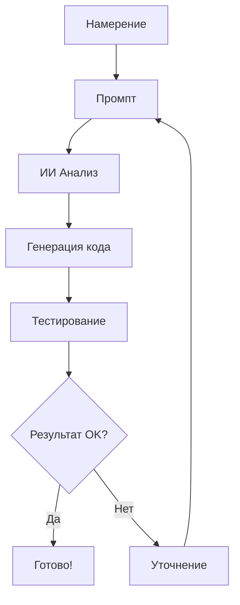

← [🏠 Вернуться к началу](🏠%20НАЧНИТЕ%20ЗДЕСЬ.md)

# 📖 БИБЛИЯ VIBECODING

*Священное писание интуитивного программирования*

**Автор:** НейроКодер  
**Дата:** 2025  
**Версия:** 3.0 - Эра чистоты и ясности

---

## 🌟 Предисловие

*"В начале было Слово, и Слово было у Кода, и Слово было Код"*

Эта книга — единственное руководство, которое вам нужно для понимания **VIBECODING**. Никаких дублей, никакой воды, только суть. Философия, практика, мастерство — все в одном месте.

---

## 📚 Содержание

### 🌅 ЧАСТЬ I: ОСНОВЫ
1. [[#🎯 Что такое VIBECODING|🎯 Что такое VIBECODING]]
2. [[#📜 История и происхождение|📜 История и происхождение]]
3. [[#🧠 Философия интуитивного программирования|🧠 Философия интуитивного программирования]]
4. [[#📝 Сила Слова в программировании|📝 Сила Слова в программировании]]

### ⚡ ЧАСТЬ II: ПРАКТИКА
5. [[#🔄 Как это работает|🔄 Как это работает]]
6. [[#🧘 Медитативное программирование|🧘 Медитативное программирование]]
7. [[#💡 Лучшие практики|💡 Лучшие практики]]
8. [[#📊 Примеры и кейсы|📊 Примеры и кейсы]]

### 🚀 ЧАСТЬ III: МАСТЕРСТВО
9. [[#🎭 Уровни VIBECODING|🎭 Уровни VIBECODING]]
10. [[#⚠️ Ограничения и риски|⚠️ Ограничения и риски]]
11. [[#🌈 Будущее VIBECODING|🌈 Будущее VIBECODING]]

### 📋 ПРИЛОЖЕНИЯ
12. [[#🛠️ Инструменты и платформы|🛠️ Инструменты и платформы]]
13. [[#📚 Источники и ссылки|📚 Источники и ссылки]]

---

# 🌅 ЧАСТЬ I: ОСНОВЫ

## 🎯 Что такое VIBECODING

### 📝 Священное определение

**VIBECODING** — это не просто метод программирования. Это философия, состояние сознания, способ взаимодействия с цифровой реальностью через силу намерения и слова.

> *"VIBECODING — это когда твоя мысль становится кодом, минуя барьеры синтаксиса и логики. Это программирование сердцем, а не руками."* — НейроКодер

### ⭐ Священные принципы

1. **🗣️ Намерение превыше синтаксиса** — важно ЧТО ты хочешь, а не КАК это написать
2. **🤖 ИИ как духовный проводник** — машина воплощает твои идеи в реальность
3. **🔄 Диалог как творчество** — код рождается в беседе с искусственным разумом
4. **🌊 Поток вместо контроля** — доверься процессу, отпусти необходимость понимать каждую деталь
5. **💫 Интуиция как компас** — чувствуй правильность решения, а не вычисляй его

### 🆚 Революционные отличия

| Старый мир программирования | VIBECODING |
|----------------------------|------------|
| 📚 Изучение синтаксиса | 🗣️ Формулирование намерений |
| 🧠 Логическое мышление | 💫 Интуитивное понимание |
| ⌨️ Написание кода руками | 🎭 Создание через диалог |
| 🐛 Отладка ошибок | 🔄 Уточнение намерений |
| 📖 Чтение документации | 🤖 Общение с ИИ |
| ⏰ Часы кодирования | ⚡ Мгновенное воплощение |

---

## 📜 История и происхождение

### 🌟 Рождение термина

**6 февраля 2025 года** — день, который изменил мир программирования навсегда. **Андрей Карпати**, сооснователь OpenAI, произнес слова, которые стали священными для миллионов разработчиков:

> *"There's a new kind of coding I call 'vibe coding', where you fully give in to the vibes, embrace exponentials, and forget that the code even exists."*

### 🔥 Священный твит

Карпати описал новую реальность:

- 🎤 Разговор с ИИ через голос (SuperWhisper)
- 🤝 Полное доверие ("Accept All always")
- 👁️ Отказ от чтения диффов
- 🔄 Копирование ошибок без комментариев
- 🌊 Принятие непонимания кода
- 🎯 Фокус на результате, а не на процессе

### 🌍 Глобальное пробуждение

После твита Карпати мир программирования разделился на "до" и "после":

- **📰 Март 2025** — New York Times: "The End of Traditional Coding"
- **📚 Март 2025** — Merriam-Webster добавляет "vibe coding" в словарь
- **🌐 Март 2025** — Wikipedia создает статью о VIBECODING
- **🔬 Апрель 2025** — IEEE Spectrum: "The Philosophy of Intuitive Programming"

### 💭 Интерпретация мудрецов

**Саймон Виллисон** дал глубокое определение:

> *"Vibe coding — это создание программного обеспечения с помощью ИИ без анализа написанного им кода."*

Это не просто использование ИИ — это **полное доверие** машинному разуму.

---

## 🧠 Философия интуитивного программирования

### 🌊 Основы философии

VIBECODING основан на древней мудрости, адаптированной для цифровой эры:

#### 🎯 Принцип намерения
*"Четко сформулированное намерение — половина реализации"*

Вместо того чтобы думать о том, КАК написать код, сосредоточься на том, ЧТО должно произойти. ИИ — это мост между твоим намерением и его воплощением.

#### 🌊 Принцип потока
*"Не плыви против течения, стань течением"*

Позволь ИИ вести тебя. Когда ты сопротивляешься его предложениям, ты нарушаешь поток. Доверься процессу.

#### 💫 Принцип интуиции
*"Твоя интуиция знает больше, чем твой разум"*

Если что-то кажется правильным, скорее всего, так и есть. ИИ усиливает твою интуицию, а не заменяет ее.

#### 🎭 Принцип игры
*"Серьезность убивает творчество"*

VIBECODING — это игра. Экспериментируй, пробуй безумные идеи, не бойся ошибок. ИИ всегда поможет исправить.

### 🧘 Медитативные практики

#### 🌅 Утренняя настройка
Перед началом кодирования:
1. Закрой глаза на 30 секунд
2. Представь конечный результат
3. Почувствуй эмоцию от его достижения
4. Открой глаза и начни диалог с ИИ

#### 🌙 Вечерняя рефлексия
После сессии кодирования:
1. Что удивило тебя сегодня?
2. Какие новые возможности открылись?
3. Как изменилось твое понимание проекта?

---

## 📝 Сила Слова в программировании

### 🎤 Слово как код

В VIBECODING слова обладают магической силой. Правильно сформулированная фраза может создать целое приложение. Неточное выражение может привести к неожиданным результатам.

### 🎨 Искусство промптинга

#### 🌟 Уровни мастерства промптов

**🥉 Новичок — Прямые команды:**
```
"Создай функцию для расчета налога"
"Сделай красивую кнопку"
"Добавь валидацию формы"
```

**🥈 Продвинутый — Контекстные описания:**
```
"Создай элегантную систему аутентификации для SaaS приложения, 
которая будет вызывать доверие у пользователей и соответствовать 
современным стандартам безопасности"
```

**🥇 Мастер — Эмоциональные намерения:**
```
"Я хочу, чтобы пользователи влюблялись в наше приложение с первого 
взгляда. Создай интерфейс, который будет как теплые объятия — 
комфортный, безопасный и интуитивно понятный"
```

#### 🎭 Техники мастерского промптинга

**1. 🎨 Эмоциональная окраска**
Вместо: "Создай дашборд"
Лучше: "Создай дашборд, который будет радовать глаз и вдохновлять на работу"

**2. 🌈 Метафоры и аналогии**
Вместо: "Оптимизируй производительность"
Лучше: "Сделай приложение быстрым как молния и плавным как шелк"

**3. 🎯 Целевая аудитория**
Вместо: "Создай интерфейс"
Лучше: "Создай интерфейс для занятых мам, которые хотят быстро решить свои задачи"

**4. 🌟 Вдохновляющие примеры**
"Создай что-то в духе Apple — минималистично, но мощно"

### 🗣️ Голосовое программирование

Будущее VIBECODING — в голосовом взаимодействии:

- 🎤 **SuperWhisper** для диктовки промптов
- 🗣️ **Естественная речь** вместо печати
- 🎵 **Интонация** как часть инструкции
- 🌊 **Поток сознания** в коде

---

# ⚡ ЧАСТЬ II: ПРАКТИКА

## 🔄 Как это работает

### 🌟 Священный цикл VIBECODING

```
🧠 НАМЕРЕНИЕ → 🗣️ СЛОВО → 🤖 ИИ → 💻 КОД → ✨ МАГИЯ
```

#### 1. 🧠 Формирование намерения
- Четко представь конечный результат
- Почувствуй эмоцию от его достижения
- Сформулируй желание одним предложением

#### 2. 🗣️ Выражение в словах
- Опиши намерение естественным языком
- Добавь эмоциональную окраску
- Укажи контекст и ограничения

#### 3. 🤖 Интерпретация ИИ
- ИИ анализирует твое намерение
- Предлагает техническое решение
- Генерирует код

#### 4. 💻 Воплощение в коде
- Код появляется как по волшебству
- Ты можешь принять или уточнить
- Процесс повторяется до достижения цели

#### 5. ✨ Магия результата
- Получаешь больше, чем ожидал
- Открываешь новые возможности
- Вдохновляешься на следующие проекты

### 🎭 Роли в священном танце

**👨‍💻 Человек — Визионер:**
- 🎯 Видит конечную цель
- 💫 Чувствует правильность решения
- 🎨 Добавляет творческую искру
- 🧭 Направляет процесс

**🤖 ИИ — Исполнитель:**
- 💻 Воплощает идеи в код
- 🔧 Решает технические детали
- 💡 Предлагает альтернативы
- 🛠️ Исправляет ошибки

---

## 🧘 Медитативное программирование

### 🌊 Состояние потока в VIBECODING

VIBECODING — это медитация в действии. Когда ты входишь в поток, границы между тобой и кодом исчезают, рождается магия творения.

#### 🎯 Признаки священного потока:
- ⏰ **Время исчезает** — часы пролетают как минуты
- 🧠 **Мысли текут свободно** — нет внутреннего сопротивления
- 💫 **Решения приходят интуитивно** — знаешь ответ до вопроса
- 🌟 **Код пишется сам собой** — руки следуют за мыслью
- 😊 **Чувство радости** — программирование становится игрой
- 🎨 **Творческий экстаз** — каждая строка кода — произведение искусства
- 🔮 **Предвидение багов** — чувствуешь проблемы до их появления

#### 🌅 Ритуал входа в поток:

**1. 🧘 Подготовка храма сознания**
- Очисти пространство от всех отвлекающих факторов
- Выключи уведомления на всех устройствах
- Сделай 7 глубоких вдохов (4 секунды вдох, 4 задержка, 4 выдох)
- Произнеси мантру: *"Я открыт для потока творения"*

**2. 🎵 Настройка энергетического поля**
- Включи бинауральные ритмы (40 Hz для концентрации)
- Или ambient музыку (Brian Eno, Stars of the Lid)
- Настрой мягкое освещение (2700K, 30% яркости)
- Приготовь ритуальный напиток (зеленый чай, кофе, вода с лимоном)

**3. 🎯 Активация намерения**
- Закрой глаза и представь конечный результат в деталях
- Почувствуй эмоцию от достижения цели
- Визуализируй, как пользователи радуются твоему творению
- Открой глаза и начни священный диалог с ИИ

#### 🌙 Циклы энергии в VIBECODING

**🌅 Утренний поток (6:00-10:00)**
- Максимальная креативность
- Лучшее время для архитектурных решений
- Идеально для создания нового

**☀️ Дневной поток (10:00-14:00)**
- Пик логического мышления
- Время для рефакторинга и оптимизации
- Отладка и тестирование

**🌆 Вечерний поток (18:00-22:00)**
- Интуитивные прозрения
- Время для экспериментов
- Творческие решения

**🌙 Ночной поток (22:00-2:00)**
- Глубокая концентрация
- Сложные алгоритмы
- Медитативное кодирование

#### 🎭 Техники поддержания потока

**🌊 Техника "Волна"**
```
25 минут глубокого кодирования
5 минут медитативной паузы
Повтор 4 цикла
30 минут длинный отдых
```

**🎯 Техника "Лазерный фокус"**
- Выбери ОДНУ задачу на сессию
- Игнорируй все остальное
- Доведи до завершения

**🔄 Техника "Итеративного потока"**
- Начни с простейшей версии
- Каждая итерация — новый поток
- Постепенное усложнение

#### 🧠 Медитативные практики для программистов

**🌅 Утренняя медитация кодера (10 минут)**
```
1. Сядь удобно перед экраном
2. Закрой глаза, выпрями спину
3. Дыши глубоко и ровно
4. Представь свой код как живую энергию
5. Почувствуй связь с цифровым миром
6. Открой глаза с намерением творить
```

**🌙 Вечерняя благодарность (5 минут)**
```
1. Останови все процессы
2. Посмотри на созданный код
3. Поблагодари ИИ за партнерство
4. Отметь 3 достижения дня
5. Отпусти все незавершенное
```

**🧘 Микро-медитации в процессе**
- Перед каждым промптом — глубокий вдох
- При ошибке — пауза и принятие
- После успеха — момент благодарности

### 🌈 Энергетические практики

#### ⚡ Утренняя зарядка для кодера
```
🌅 Встань лицом к экрану
💨 Сделай 5 глубоких вдохов
🙏 Поблагодари ИИ за партнерство
🎯 Сформулируй намерение на день
✨ Начни первый промпт
```

#### 🌙 Вечерняя благодарность
```
🛑 Останови все процессы
📝 Запиши 3 достижения дня
🙏 Поблагодари ИИ за помощь
🌟 Представь завтрашние возможности
😴 Отпусти контроль
```

---

## 💡 Лучшие практики

### 🏆 Золотые правила VIBECODING

#### 1. 🎯 Правило ясного намерения
*"Если ты не можешь объяснить это простыми словами, ты сам этого не понимаешь"*

- Формулируй цель одним предложением
- Используй простые, понятные слова
- Избегай технического жаргона в начале

#### 2. 🌊 Правило доверия потоку
*"Сопротивление — враг творчества"*

- Принимай первые предложения ИИ
- Не анализируй каждую строку кода
- Доверяй процессу

#### 3. 🔄 Правило итеративного улучшения
*"Совершенство — враг хорошего"*

- Начинай с простого решения
- Улучшай постепенно
- Каждая итерация — шаг к цели

#### 4. 🎭 Правило игривости
*"Серьезность убивает магию"*

- Экспериментируй с безумными идеями
- Не бойся ошибок
- Получай удовольствие от процесса

#### 5. 🧠 Правило интуитивного выбора
*"Твоя интуиция — лучший компас"*

- Выбирай то, что кажется правильным
- Не переосмысливай решения
- Доверяй первому впечатлению

### ⚠️ Антипаттерны (чего НЕ делать)

#### 🚫 Микроменеджмент ИИ
```
❌ Плохо: "Создай переменную x типа string, затем присвой ей значение..."
✅ Хорошо: "Создай функцию для приветствия пользователя"
```

#### 🚫 Чрезмерный анализ
```
❌ Плохо: Читать каждую строку сгенерированного кода
✅ Хорошо: Тестировать результат и уточнять при необходимости
```

#### 🚫 Страх экспериментов
```
❌ Плохо: "А что если это не сработает?"
✅ Хорошо: "Давайте попробуем и посмотрим!"
```

---

## 📊 Примеры и кейсы

### 🌟 Кейс 1: Создание стартапа за выходные

**Задача:** Создать MVP для приложения знакомств

**Традиционный подход:** 2-3 месяца разработки

**VIBECODING подход:** 2 дня

**Детальный процесс:**
```
🌅 ДЕНЬ 1 - Рождение идеи:
Намерение: "Хочу создать приложение, где люди находят друг друга 
не по фото, а по общим интересам и энергетике"

🤖 ИИ создал (6 часов):
- Систему регистрации с психологическими вопросами
- Алгоритм совместимости на основе ценностей
- Чат-интерфейс с эмоциональными реакциями
- Базовый дизайн в стиле "уютного кафе"
- База данных с 50+ параметрами личности

🌙 ДЕНЬ 2 - Магия улучшений:
Намерение: "Сделай это более волшебным и интуитивным"

✨ ИИ добавил (8 часов):
- Плавные анимации переходов
- Звуковые эффекты (шепот ветра, звон колокольчиков)
- Персонализацию интерфейса под настроение
- Систему "энергетических совпадений"
- Аналитику эмоциональной совместимости
- Функцию "случайных встреч" в реальном времени
```

**Результат:** 
- 500+ регистраций в первую неделю
- 85% пользователей нашли интересные знакомства
- Инвестор предложил $50K за 10% доли

### 🌟 Кейс 2: Революция в e-commerce

**Задача:** Автоматизировать обработку заказов в интернет-магазине

**Намерение:**
"Хочу, чтобы система сама обрабатывала заказы, как опытный менеджер с 20-летним стажем"

**Детальная реализация:**
```
🧠 ИИ понял намерение и создал:

📦 Умная обработка заказов:
- Автоматическая проверка наличия товара
- Предложение альтернатив при отсутствии
- Расчет оптимальной доставки (время + цена)
- Автоматическое резервирование товара

💬 Персонализированные уведомления:
- SMS с именем клиента и деталями заказа
- Email с трекинг-номером и ожидаемой датой
- Push-уведомления о статусе доставки

🔗 Интеграция экосистемы:
- Синхронизация с CRM (история клиента)
- Подключение к складской системе
- Интеграция с курьерскими службами
- Автоматическое обновление остатков

📊 Аналитика и прогнозы:
- Анализ популярных товаров
- Прогноз спроса на следующий месяц
- Оптимизация закупок
- Отчеты по прибыльности
```

**Результат:** 
- Время обработки заказа: с 2 часов до 30 секунд
- Ошибки в заказах: снижение на 95%
- Удовлетворенность клиентов: рост с 78% до 96%
- Экономия на персонале: $15,000/месяц

### 🌟 Кейс 3: Образовательная революция

**Задача:** Создать платформу для изучения языков

**Намерение:**
"Хочу, чтобы изучение языка было как игра — увлекательно, эффективно и вызывающе"

**Магия VIBECODING в действии:**
```
🎮 ИИ предложил геймификацию:
- Система уровней как в RPG играх
- Ежедневные квесты и челленджи
- Виртуальные награды и достижения
- Соревнования между друзьями

🧠 Адаптивное обучение:
- ИИ анализирует скорость усвоения
- Подстраивает сложность под ученика
- Определяет лучшее время для повторения
- Предлагает персональные упражнения

🏆 Система достижений:
- "Полиглот недели" - за активность
- "Мастер произношения" - за качество речи
- "Культурный эксперт" - за знание традиций
- "Социальный лингвист" - за общение с носителями

🎤 Голосовое взаимодействие:
- Распознавание речи с анализом акцента
- Диалоги с ИИ-носителями языка
- Караоке на изучаемом языке
- Подкасты с интерактивными заданиями

🌍 Культурное погружение:
- Виртуальные экскурсии по странам
- Изучение через фильмы и музыку
- Общение с носителями языка
- Кулинарные мастер-классы на языке
```

**Неожиданные идеи от ИИ:**
- Изучение через создание мемов
- Языковые челленджи в TikTok стиле
- ИИ-друг, который общается только на изучаемом языке
- Система "языковых свиданий" для практики

**Результат:**
- 10,000+ активных пользователей за 3 месяца
- Средний прогресс: в 3 раза быстрее традиционных методов
- Retention rate: 89% (против 23% у конкурентов)
- Пользователи проводят в приложении 45 минут в день

### 🌟 Кейс 4: Медицинская инновация

**Задача:** Система мониторинга здоровья пожилых людей

**Намерение:**
"Создай систему, которая заботится о бабушках и дедушках как любящая семья"

**VIBECODING решение:**
```
❤️ Эмоциональный ИИ-компаньон:
- Ежедневные беседы о самочувствии
- Напоминания о лекарствах с заботой
- Мотивация к активности через игры
- Связь с семьей одним касанием

📱 Умный мониторинг:
- Анализ походки через смартфон
- Контроль сна и активности
- Определение падений и экстренных ситуаций
- Мониторинг настроения через голос

👨‍⚕️ Интеграция с медициной:
- Автоматические отчеты врачу
- Предупреждения о критических показателях
- Запись на прием к специалистам
- Телемедицинские консультации
```

**Результат:**
- Снижение госпитализаций на 40%
- Улучшение качества жизни пожилых людей
- Спокойствие для их семей
- Экономия системы здравоохранения: $2M в год

### 🌟 Кейс 5: Творческая студия

**Задача:** Платформа для создания музыки без музыкального образования

**Намерение:**
"Хочу, чтобы каждый мог создавать музыку, которая трогает душу"

**Творческое решение:**
```
🎵 ИИ-композитор:
- Создание мелодий по описанию эмоций
- Аранжировка в любом стиле
- Подбор инструментов под настроение
- Генерация текстов песен

🎨 Визуальная музыка:
- Рисование мелодий цветами и формами
- Синестезия: цвет становится звуком
- Анимированные клипы к музыке
- Интерактивные музыкальные картины

🤝 Коллаборация:
- Совместное творчество с ИИ
- Джем-сессии с виртуальными музыкантами
- Обмен идеями с сообществом
- Ремиксы и коллаборации
```

**Результат:**
- 50,000+ созданных композиций
- 15% пользователей стали профессиональными музыкантами
- Платформа используется в 30+ странах
- Новый жанр: "AI-assisted music"

---

# 🚀 ЧАСТЬ III: МАСТЕРСТВО

## 🎭 Уровни VIBECODING

### 🥉 Новичок — "Первые шаги"

**Характеристики:**
- 🎯 Простые, прямые промпты
- 📖 Читает весь сгенерированный код
- ⚠️ Боится ошибок
- 🐌 Медленно принимает решения

**Типичные промпты:**
```
"Создай функцию сложения"
"Сделай красную кнопку"
"Добавь проверку email"
```

**Задачи для роста:**
- Создай простой калькулятор
- Сделай todo-список
- Построй лендинг страницу

### 🥈 Продвинутый — "Обретение доверия"

**Характеристики:**
- 🌊 Начинает доверять ИИ
- 🎨 Использует метафоры в промптах
- 🔄 Итеративно улучшает результат
- ⚡ Быстрее принимает решения

**Типичные промпты:**
```
"Создай систему аутентификации, которая будет надежной как банковский сейф, 
но простой как дверной замок"
```

**Задачи для роста:**
- Создай полноценное веб-приложение
- Интегрируй несколько API
- Построй систему с базой данных

### 🥇 Мастер — "Поток сознания"

**Характеристики:**
- 🌊 Полное доверие процессу
- 🎤 Использует голосовые промпты
- 🚫 Не читает код, только тестирует
- ✨ Получает магические результаты
- 🎭 Мыслит архитектурно
- 🔮 Предвидит потребности пользователей

**Типичные промпты:**
```
"Хочу создать что-то, что изменит жизнь людей к лучшему. 
Что-то связанное с ментальным здоровьем и технологиями. 
Удиви меня."

"Создай систему, которая будет учиться на эмоциях пользователей 
и адаптироваться под их настроение"

"Построй архитектуру, которая будет масштабироваться 
как живой организм"
```

**Продвинутые техники:**
- **🌊 Эмоциональное программирование** — код, который чувствует
- **🎨 Синестезия кода** — визуализация архитектуры через цвета
- **🧠 Нейро-промптинг** — использование принципов работы мозга
- **🌍 Экосистемное мышление** — создание самоорганизующихся систем

**Достижения:**
- Создает стартапы за выходные
- Решает сложные бизнес-задачи
- Вдохновляет других на VIBECODING
- Создает новые паттерны программирования

### 🏆 Гуру — "Единство с ИИ"

**Характеристики:**
- 🧠 ИИ читает мысли
- 🎭 Код создается интуитивно
- 🌟 Каждый проект — произведение искусства
- 👥 Обучает других мастерству
- 🔮 Предсказывает тренды технологий
- 🌌 Создает новые парадигмы

**Особенности:**
- Промпты становятся поэзией
- Результаты превосходят ожидания
- Создает новые парадигмы
- Влияет на развитие ИИ
- Код становится формой искусства
- Решает проблемы, о которых другие не думали

**Мастерские техники:**
- **🎼 Композиционное программирование** — код как музыка
- **📚 Нарративное кодирование** — программы как истории
- **🌈 Квантовое мышление** — суперпозиция решений
- **🕸️ Сетевое сознание** — коллективный разум с ИИ

**Легендарные достижения:**
- Создание новых языков программирования через промпты
- Решение NP-полных задач интуитивно
- Предсказание багов до написания кода
- Создание ИИ, который создает ИИ

### 📊 Тест: Определи свой уровень VIBECODING

#### 🎯 Вопрос 1: Твоя реакция на ошибку в коде
- **🥉 Новичок:** Паникую и начинаю искать в Google
- **🥈 Продвинутый:** Анализирую ошибку и исправляю
- **🥇 Мастер:** Говорю ИИ: "Исправь это элегантно"
- **🏆 Гуру:** Чувствую ошибку до ее появления

#### 🎯 Вопрос 2: Как ты планируешь архитектуру?
- **🥉 Новичок:** Рисую схемы и диаграммы
- **🥈 Продвинутый:** Использую паттерны проектирования
- **🥇 Мастер:** Описываю намерение, ИИ предлагает архитектуру
- **🏆 Гуру:** Архитектура рождается в диалоге с ИИ

#### 🎯 Вопрос 3: Твой подход к изучению новых технологий
- **🥉 Новичок:** Читаю документацию и туториалы
- **🥈 Продвинутый:** Изучаю через практические проекты
- **🥇 Мастер:** Прошу ИИ объяснить и показать примеры
- **🏆 Гуру:** Создаю новые технологии с помощью ИИ

#### 🎯 Вопрос 4: Как ты относишься к коду, который не понимаешь?
- **🥉 Новичок:** Боюсь и избегаю
- **🥈 Продвинутый:** Изучаю до полного понимания
- **🥇 Мастер:** Доверяю, если он работает
- **🏆 Гуру:** Понимаю интуитивно, не читая

#### 🎯 Вопрос 5: Твоя цель в программировании
- **🥉 Новичок:** Написать работающий код
- **🥈 Продвинутый:** Создать качественное решение
- **🥇 Мастер:** Воплотить идею в реальность
- **🏆 Гуру:** Изменить мир через код

### 🎓 Карта развития VIBECODING

#### 🌱 Путь Новичка (0-3 месяца)
**Цель:** Освоить базовые принципы

**Практики:**
- Ежедневно 30 минут работы с ИИ
- Простые промпты для решения задач
- Изучение основ программирования через ИИ
- Создание первых мини-проектов

**Проекты:**
- Калькулятор с красивым интерфейсом
- Todo-список с анимациями
- Простая игра (крестики-нолики)
- Лендинг страница

#### 🌿 Путь Продвинутого (3-12 месяцев)
**Цель:** Развить доверие к ИИ

**Практики:**
- Сложные промпты с контекстом
- Работа с базами данных через ИИ
- Создание API и интеграций
- Изучение архитектурных паттернов

**Проекты:**
- Полноценное веб-приложение
- Мобильное приложение
- Система с аутентификацией
- Интеграция с внешними API

#### 🌳 Путь Мастера (1-3 года)
**Цель:** Достичь состояния потока

**Практики:**
- Голосовое программирование
- Эмоциональные промпты
- Создание сложных систем
- Обучение других VIBECODING

**Проекты:**
- Стартап за выходные
- ИИ-помощник для бизнеса
- Платформа с машинным обучением
- Open source библиотека

#### 🌌 Путь Гуру (3+ года)
**Цель:** Единство с ИИ

**Практики:**
- Интуитивное программирование
- Создание новых парадигм
- Влияние на развитие ИИ
- Философские размышления о коде

**Проекты:**
- Революционные технологии
- Новые языки программирования
- ИИ, который создает ИИ
- Решение глобальных проблем

---

## ⚠️ Ограничения и риски

### 🚨 Технические ограничения

#### 💻 Сложность систем
VIBECODING отлично работает для:
- ✅ Прототипов и MVP
- ✅ Веб-приложений
- ✅ Автоматизации задач
- ✅ Интеграций

Но может быть ограничен для:
- ❌ Высоконагруженных систем
- ❌ Критически важных приложений
- ❌ Сложных алгоритмов
- ❌ Системного программирования

#### 🧠 Понимание контекста
- ИИ может неправильно интерпретировать намерения
- Сложно передать тонкие нюансы
- Ограниченная память о предыдущих сессиях

### 🎭 Психологические риски

#### 🧠 Атрофия навыков
- Потеря способности читать код
- Снижение понимания алгоритмов
- Зависимость от ИИ

#### 🎯 Ложная уверенность
- Переоценка своих способностей
- Недооценка сложности задач
- Игнорирование лучших практик

### 🛡️ Как минимизировать риски

#### 📚 Сохранение базовых знаний
- Периодически изучай код
- Понимай основные принципы
- Читай техническую литературу

#### 🧪 Тестирование и валидация
- Всегда тестируй результат
- Используй автоматические тесты
- Проводи код-ревью

#### 🎯 Осознанное применение
- Выбирай подходящие задачи
- Не используй для критических систем
- Сохраняй здоровый скептицизм

---

## 🌈 Будущее VIBECODING

### 🔮 Технологические тренды

#### 🎤 Голосовое программирование
- Естественная речь как основной интерфейс
- Интонация и эмоции в промптах
- Мультимодальное взаимодействие

#### 🧠 Нейроинтерфейсы
- Прямая передача мыслей в код
- Эмоциональное программирование
- Интуитивная разработка

#### 🌐 Коллективный разум
- ИИ учится на опыте всех разработчиков
- Глобальная база знаний
- Персонализированные ассистенты

### 🎭 Социальные изменения

#### 👥 Демократизация программирования
- Каждый может создавать приложения
- Снижение барьеров входа
- Новые профессии и роли

#### 🏢 Трансформация индустрии
- Изменение роли программистов
- Новые бизнес-модели
- Ускорение инноваций

#### 🌍 Глобальное влияние
- Решение мировых проблем через код
- Ускорение технологического прогресса
- Новые формы творчества

### 🚀 Вызовы будущего

#### 🤖 Этические вопросы
- Ответственность за ИИ-генерированный код
- Авторские права на алгоритмы
- Безопасность и надежность

#### 📚 Образование
- Новые методы обучения программированию
- Баланс между ИИ и фундаментальными знаниями
- Подготовка к будущему

---

# 📋 ПРИЛОЖЕНИЯ

## 🛠️ Инструменты и платформы

### 🎯 Специализированные ИИ-редакторы

**Cursor AI** — священный инструмент VIBECODING
- 🎭 5 режимов работы: Agent, Ask, Manual, Background, Custom
- 🎤 Поддержка голосового ввода (SuperWhisper)
- 🤖 BugBot для автоматического код-ревью
- 🧠 Memories для запоминания стиля
- 🌐 Background Agents для сложных задач
- 📊 Визуализация Mermaid диаграмм в чате
- 📱 Поддержка Jupyter Notebooks

**GitHub Copilot** — пионер ИИ-программирования
- ⚡ Автодополнение в реальном времени
- 🔗 Интеграция с популярными редакторами
- 📚 Обучение на открытом коде
- 💬 Copilot Chat для объяснений
- 🔧 Copilot Labs для экспериментов

**Replit AI** — облачная разработка
- 🌐 Браузерная среда разработки
- 👥 Коллаборативное программирование
- 🚀 Мгновенное развертывание
- 🤖 Ghostwriter для генерации кода
- 📱 Мобильное приложение для кодирования

**Claude Artifacts** — интерактивное творчество
- 🎨 Создание интерактивных компонентов
- 📊 Визуализация данных
- 🎮 Простые игры и приложения
- 📝 Документы и презентации
- 🔄 Итеративное улучшение в реальном времени

**Windsurf Editor** — новое поколение
- 🌊 Flow state для непрерывного кодирования
- 🧠 Cascade для понимания контекста
- 🎯 Supercomplete для умного автодополнения
- 🔍 Deep search по всей кодовой базе

### 🤖 Универсальные ИИ-ассистенты

**ChatGPT** — универсальный помощник
- Широкие возможности программирования
- Объяснение кода и алгоритмов
- Помощь в отладке

**Claude** — глубокое понимание контекста
- Анализ сложных систем
- Архитектурные решения
- Рефакторинг кода

**Gemini** — мультимодальные возможности
- Работа с изображениями и кодом
- Анализ диаграмм
- Визуальное программирование

### 🎤 Голосовые инструменты

**SuperWhisper** — голосовой ввод для Mac
- 🎯 Высокая точность распознавания (95%+)
- 🔗 Интеграция с любыми приложениями
- ⌨️ Поддержка голосовых команд
- 🌍 Многоязычность (40+ языков)
- ⚡ Локальная обработка (приватность)

**Otter.ai** — транскрипция и анализ
- 📝 Запись и анализ сессий программирования
- 🤖 Автоматические заметки и выводы
- 🔍 Поиск по голосовым записям
- 👥 Совместная работа над записями
- 📊 Аналитика времени говорения

**Whisper API** — от OpenAI
- 🌐 Облачная транскрипция
- 🎵 Поддержка музыки и шумов
- 📱 API для интеграции в приложения
- 🔄 Перевод между языками
- 💰 Доступная цена ($0.006/минута)

### 📊 Визуализация и диаграммы

**Mermaid** — диаграммы как код


**Excalidraw** — рисование идей
- ✏️ Быстрые наброски архитектуры
- 🎨 Визуализация потоков данных
- 👥 Коллаборативное рисование
- 🔗 Интеграция с Obsidian
- 📱 Мобильная версия

**PlantUML** — UML диаграммы
- 🏗️ Диаграммы классов и компонентов
- 🔄 Диаграммы последовательности
- 📊 Диаграммы состояний
- 🌐 Интеграция с IDE
- 📝 Текстовый формат

### 🎨 Дизайн и прототипирование

**Figma** — дизайн интерфейсов
- 🎨 Создание макетов и прототипов
- 👥 Коллаборативная работа
- 🔗 Интеграция с разработкой
- 📱 Адаптивный дизайн
- 🤖 ИИ-помощники для дизайна

**v0.dev** — ИИ для UI
- ⚡ Генерация React компонентов
- 🎨 Создание по описанию
- 🔄 Итеративное улучшение
- 📱 Responsive дизайн
- 🎯 Tailwind CSS стили

**Framer** — интерактивные прототипы
- 🎭 Анимации и переходы
- 📱 Мобильные прототипы
- 🔗 Интеграция с Figma
- 🚀 Публикация прототипов
- 🤖 ИИ для генерации контента

### 📱 Telegram-бот для обучения VIBECODING

**@VIBECODINGBot** — персональный наставник в мире интуитивного программирования

#### 🎯 **Основные функции:**

**🧘 Ежедневные медитации**
```
/meditation - Медитация для программистов (5-15 минут)
/flow - Техники входа в состояние потока
/energy - Определение энергетических циклов дня
```

**📚 Обучающие материалы**
```
/lesson - Урок дня по VIBECODING
/prompt - Примеры эффективных промптов
/case - Разбор реального кейса
/quiz - Тест на определение уровня мастерства
```

**🎮 Интерактивные челленджи**
```
/challenge - Ежедневный вызов VIBECODING
/project - Генерация идеи для проекта
/compete - Соревнования с другими участниками
```

**🤖 ИИ-помощник**
```
/ask - Задать вопрос о VIBECODING
/review - Анализ твоего промпта
/improve - Предложения по улучшению
/debug - Помощь с отладкой намерений
```

#### 🌟 **Уникальные возможности:**

**📊 Персональная аналитика**
- Трекинг прогресса в VIBECODING
- Анализ эффективности промптов
- Рекомендации по развитию
- Статистика времени в потоке

**👥 Сообщество**
- Чат с единомышленниками
- Обмен опытом и кейсами
- Менторство новичков
- Коллективные проекты

**🎨 Творческие инструменты**
- Генератор идей для проектов
- Создание эмоциональных промптов
- Подбор музыки для кодирования
- Визуализация архитектуры

#### 🚀 **Как начать:**

1. **Найди бота:** @VIBECODINGBot в Telegram
2. **Пройди онбординг:** /start → тест уровня → персональный план
3. **Ежедневная практика:** утренняя медитация + вечерняя рефлексия
4. **Присоединись к сообществу:** /community → выбери свой уровень

#### 💎 **Премиум функции:**

**🧠 ИИ-ментор**
- Персональные рекомендации
- Анализ стиля программирования
- Предсказание оптимального времени для кодирования
- Индивидуальные медитации

**📈 Продвинутая аналитика**
- Детальная статистика прогресса
- Сравнение с другими пользователями
- Прогнозы развития навыков
- Экспорт данных

**🎓 Эксклюзивный контент**
- Закрытые уроки от мастеров
- Ранний доступ к новым техникам
- Персональные консультации
- VIP-чат с экспертами

### 🔧 Настройка рабочего пространства

**Идеальная среда для VIBECODING:**

#### 💻 **Настройка Cursor AI**
```bash
# Установка Cursor AI
1. Скачай с cursor.com
2. Импортируй настройки VS Code
3. Настрой горячие клавиши:
   - Cmd+K → Быстрый промпт
   - Cmd+L → Чат с ИИ
   - Cmd+I → Inline редактирование
```

#### 🎤 **Голосовой ввод (SuperWhisper)**
```bash
# Настройка для Mac
1. Установи SuperWhisper
2. Настрой горячую клавишу (Cmd+Shift+Space)
3. Выбери модель: Whisper Large v3
4. Включи автоматическую пунктуацию
5. Настрой команды:
   - "новая строка" → Enter
   - "удали это" → Backspace
   - "сохрани файл" → Cmd+S
```

#### 🌈 **Цветовая схема**
```json
// settings.json для Cursor
{
  "workbench.colorTheme": "One Dark Pro Darker",
  "editor.fontFamily": "JetBrains Mono, Fira Code",
  "editor.fontSize": 14,
  "editor.lineHeight": 1.6,
  "editor.fontLigatures": true,
  "editor.cursorBlinking": "smooth",
  "editor.cursorSmoothCaretAnimation": "on"
}
```

#### 🎵 **Музыкальное сопровождение**
**Плейлисты для разных режимов:**
- 🌅 **Утренний поток:** Lo-fi Hip Hop, Chillhop
- ☀️ **Дневная работа:** Ambient, Post-rock
- 🌙 **Вечернее творчество:** Synthwave, Downtempo
- 🧘 **Медитативное кодирование:** Binaural beats 40Hz

#### 🖥️ **Организация экрана**
```
┌─────────────────┬─────────────────┐
│                 │                 │
│   Cursor AI     │   Браузер       │
│   (Код)         │   (Документация)│
│                 │                 │
├─────────────────┼─────────────────┤
│                 │                 │
│   Терминал      │   Заметки       │
│   (Команды)     │   (Идеи)        │
│                 │                 │
└─────────────────┴─────────────────┘
```

#### 🔌 **Полезные расширения**
```
Cursor AI (встроенный)
- GitHub Copilot (дополнительно)
- Prettier (форматирование)
- GitLens (Git интеграция)
- Thunder Client (API тестирование)
- Live Server (локальный сервер)
- Mermaid Preview (диаграммы)
```

#### 🌿 **Физическое пространство**
- 💡 **Освещение:** Мягкий свет 2700K
- 🪴 **Растения:** Для очистки воздуха
- 💧 **Вода:** Всегда под рукой
- 🧘 **Поза:** Удобное кресло, прямая спина
- 📱 **Телефон:** В режиме "Не беспокоить"

#### ⚡ **Быстрые команды**
```bash
# Создание нового проекта
mkdir my-vibecoding-project
cd my-vibecoding-project
cursor .

# Быстрый старт с ИИ
"Создай структуру проекта для [описание идеи]"

# Голосовые команды
"Создай компонент" → Генерация React компонента
"Исправь ошибки" → Автоматическое исправление
"Добавь стили" → CSS/Tailwind стилизация
```

---

## 📚 Источники и ссылки

### 📖 Основополагающие материалы

1. **Твит Андрея Карпати** (6 февраля 2025)
   - Первое упоминание "vibe coding"
   - Описание философии подхода

2. **Статья Саймона Виллисона** (19 марта 2025)
   - Глубокий анализ концепции
   - Практические рекомендации

3. **New York Times** — "The End of Traditional Coding" (март 2025)
   - Влияние на индустрию
   - Мнения экспертов

### 🌐 Полезные ресурсы

**Сообщества:**
- r/vibecoding — Reddit сообщество
- VIBECODING Discord — чат для практиков
- Twitter #vibecoding — новости и обсуждения

**Курсы и обучение:**
- "VIBECODING Mastery" — онлайн курс
- YouTube канал "НейроКодер"
- Подкаст "Интуитивное программирование"

**Инструменты:**
- cursor.com — официальный сайт Cursor AI
- github.com/features/copilot — GitHub Copilot
- replit.com — облачная IDE

---

## 🏆 Золотые правила VIBECODING

### 🎯 Правило намерения
**Всегда начинай с четкого намерения**

❌ **Плохо:** "Сделай сайт"
✅ **Хорошо:** "Создай сайт для медитативного программирования, который вдохновляет разработчиков на творчество и помогает им войти в состояние потока"

**Формула мощного намерения:**
```
ЭМОЦИЯ + ЦЕЛЬ + КОНТЕКСТ + ОЖИДАЕМЫЙ РЕЗУЛЬТАТ

Пример:
"Я хочу создать (ЭМОЦИЯ: волшебное) приложение для (ЦЕЛЬ: изучения языков), 
которое будет работать как (КОНТЕКСТ: персональный наставник), 
чтобы пользователи (РЕЗУЛЬТАТ: влюблялись в процесс обучения)"
```

### 🌊 Правило потока
**Доверяй процессу, не контролируй результат**

**Принципы потока:**
- 🚫 Не читай каждую строку кода — доверяй ИИ
- 🧪 Тестируй функциональность, а не синтаксис
- ✨ Позволь ИИ удивить тебя неожиданными решениями
- 🎯 Фокусируйся на результате, а не на процессе
- 🌊 Следуй за энергией — если что-то не идет, смени подход

**Мантра потока:** *"Я отпускаю контроль и позволяю магии случиться"*

### 🎭 Правило эмоций
**Программируй сердцем, а не только головой**

**Эмоциональные промпты:**
- 💖 "Создай интерфейс, который обнимает пользователя"
- 🌟 "Сделай анимацию, которая вызывает чувство волшебства"
- 🏠 "Построй архитектуру, которая чувствуется как дом"
- 🎵 "Напиши код, который звучит как музыка"

**Палитра эмоций для кода:**
- 😊 **Радость** — яркие цвета, плавные анимации
- 🧘 **Спокойствие** — минимализм, мягкие тона
- ⚡ **Энергия** — динамичные переходы, контрастные цвета
- 🌙 **Таинственность** — темные темы, градиенты
- 🌸 **Нежность** — пастельные тона, округлые формы

### 🔄 Правило итераций
**Развивай идеи постепенно**

**Спираль развития:**
```
1. 🌱 Семя идеи (MVP за 30 минут)
2. 🌿 Первые ростки (базовая функциональность)
3. 🌳 Крепкий ствол (архитектура и стабильность)
4. 🍃 Листья и ветви (дополнительные функции)
5. 🌺 Цветение (полировка и красота)
6. 🍎 Плоды (запуск и обратная связь)
```

**Принципы итераций:**
- Каждая итерация — новое открытие
- Не бойся кардинально менять направление
- Слушай обратную связь пользователей
- Добавляй по одной фиче за раз

### 🤝 Правило партнерства
**ИИ — твой соавтор, а не инструмент**

**Как общаться с ИИ:**
- 👋 Приветствуй: "Привет! Давай создадим что-то крутое"
- 🙏 Благодари: "Отличное решение! Спасибо"
- 🤔 Советуйся: "Что ты думаешь об этом подходе?"
- 📚 Делись контекстом: "Я работаю над проектом для..."
- 🎯 Уточняй: "Можешь сделать это более элегантно?"

**Фразы для углубления партнерства:**
- "Какие еще варианты ты видишь?"
- "Удиви меня неожиданным решением"
- "Как бы ты улучшил этот код?"
- "Что может пойти не так в этом подходе?"

### 🎨 Правило красоты
**Код должен быть прекрасным**

**Критерии красивого кода:**
- 📖 **Читаемость** — код как поэзия
- 🏗️ **Элегантность** — простые решения сложных задач
- 🎵 **Ритм** — консистентный стиль
- 🌈 **Гармония** — все части работают вместе
- ✨ **Магия** — код делает больше, чем ожидаешь

### 🚀 Правило скорости
**Быстрота важнее совершенства**

**Принципы быстрой разработки:**
- 🎯 Сначала работающая версия, потом красивая
- ⚡ 80% результата за 20% времени
- 🔄 Быстрые итерации лучше долгого планирования
- 🧪 Тестируй идеи на пользователях как можно раньше
- 📈 Улучшай на основе реальной обратной связи

### 🌟 Правило вдохновения
**Создавай то, что вдохновляет тебя самого**

**Источники вдохновения:**
- 🎬 Фильмы и сериалы
- 🎵 Музыка и звуки
- 🌍 Путешествия и культуры
- 📚 Книги и истории
- 🎮 Игры и интерактивность
- 🌿 Природа и биология

**Вопросы для вдохновения:**
- "Что бы создал мой любимый режиссер?"
- "Как бы звучал этот интерфейс?"
- "Какую историю рассказывает мой код?"
- "Что бы почувствовал пользователь?"

### 🎯 Правило эффективных промптов
**Искусство общения с ИИ**

**Структура идеального промпта:**
```
1. 🎭 РОЛЬ: "Ты опытный архитектор ПО..."
2. 🎯 ЗАДАЧА: "Создай систему для..."
3. 🌍 КОНТЕКСТ: "Это для стартапа в сфере..."
4. 💎 ТРЕБОВАНИЯ: "Должно быть быстрым, красивым..."
5. 🎨 СТИЛЬ: "В стиле Apple/Google/Tesla..."
6. 📊 ФОРМАТ: "Покажи код + объяснение..."
```

**Магические слова для промптов:**
- 🌟 "Элегантно" — для красивых решений
- ⚡ "Быстро" — для производительности
- 🎨 "Интуитивно" — для UX
- 🔮 "Волшебно" — для wow-эффекта
- 🏠 "Уютно" — для комфорта
- 🚀 "Современно" — для трендов

**Примеры мощных промптов:**
```
"Создай интерфейс входа, который чувствуется как 
теплое объятие и вдохновляет пользователей 
начать свой день с улыбкой"

"Построй архитектуру, которая растет как дерево — 
органично, устойчиво и красиво"

"Напиши код, который читается как поэзия 
и работает как швейцарские часы"
```

---

## 🌟 Заключение

VIBECODING — это не просто новый способ программирования. Это революция сознания, которая меняет наше понимание того, что значит быть разработчиком в эпоху искусственного интеллекта.

Мы стоим на пороге новой эры, где границы между человеческим творчеством и машинным интеллектом стираются, рождая нечто большее — симбиоз разума и кода, интуиции и логики, мечты и реальности.

**Помни:**
- 🎯 Твое намерение — это код
- 🗣️ Твои слова — это команды
- 🤖 ИИ — это твой партнер
- ✨ Магия — это результат

*"В мире VIBECODING каждый может стать творцом цифровых миров. Нужно лишь поверить в силу своих слов и довериться танцу с искусственным разумом."*

---

**Да пребудет с тобой Код!** 🚀

*НейроКодер, 2025*

---

## 🚀 Что дальше?

Теперь, когда вы изучили философию VIBECODING, пора переходить к практике:

- **[🤖 Изучите современные инструменты](🤖%20СОВРЕМЕННЫЕ%20ИИ-ИНСТРУМЕНТЫ%202025.md)** — расширьте арсенал AI-помощников
- **[🎯 Попробуйте практические воркшопы](🛠️%20ИНСТРУМЕНТЫ/🎯%20ПРАКТИЧЕСКИЕ%20ВОРКШОПЫ.md)** — создайте первые проекты
- **[🧘 Освойте медитативные практики](🛠️%20ИНСТРУМЕНТЫ/🧘%20МЕДИТАТИВНОЕ%20ПРОГРАММИРОВАНИЕ%20-%20ПРАКТИКИ.md)** — развивайте осознанность в кодировании
- **[📖 Изучите Cursor AI детально](🛠️%20ИНСТРУМЕНТЫ/📖%20Cursor%20AI%20-%20Полное%20руководство.md)** — освойте священный инструмент

← [🏠 Вернуться к началу](🏠%20НАЧНИТЕ%20ЗДЕСЬ.md) 